## 1、内部类

- 基本介绍：一个类的内部又完整的嵌套了另一个类结构。被嵌套的类称为内部类(inner class)，嵌套其他类的类称为外部类(outer class)。是我们类的第五大成员，内部类最大的特点就是可以直接访问私有属性，并且可以体现类与类之间的包含关系。
  - 类的五大成员
    - 属性
    - 方法
    - 构造器、
    - 代码块
    - 内部类

- 基本语法：

```java
class Outer{ // 外部类
    class Inner{
        // 内部类
    }
}
class Other{
    // 外部其他类
}
```

- 快速入门

```java
// 外部类
class Outer{ 
    private int n1 = 100;

    public Outer(int n1) {
        this.n1 = n1;
    }

    public void m1(){
        System.out.println("m1()");
    }

    {
        System.out.println("代码块");
    }
    
    class Inner{
        // 内部类，在外部类的内部
    }
}
```

- 内部类的分类
  - 定义在外部类的局部位置上，比如方法中
    - 局部内部类（有类名）
    - 匿名内部类（没有类名）
  - 定义在外部类的成员位置上
    - 成员内部类（没有static修饰）
    - 静态内部类（使用static修饰）

### 1.1 局部内部类

- 可以访问外部类的所有成员，包括私有的
- 不能添加访问修饰符，因为他的地位就是一个局部变量。局部变量是不能使用访问修饰符的。但是可以使用final修饰，因为局部变量可以使用final修饰
- **作用域：仅仅在定义它的方法或代码块中**
- 局部内部类访问外部类的成员，访问方式是直接访问
- 外部类访问局部内部类的成员，访问方式是创建对象，再访问（必须再作用域中）（**外部类在方法中，可以创建内部类对象，然后调用方法即可**）

- 外部其他类不能访问局部内部类，因为局部内部类是一个局部变量
- 如果外部类和局部内部类的成员重名时，默认遵守就近原则，如果像访问外部类的成员，则可以使用（外部类名.this.成员）去访问

```java
package com.zcx.innerclass;

public class LocalInnerClass {
    public static void main(String[] args) {
        Outer2 outer2 = new Outer2();
        outer2.m1();
        System.out.println("outer2.hashcode:" + outer2.hashCode());
    }
}

class Outer2 {
    private int n1 = 100;

    private void m2() {
        // 私有方法
        System.out.println("outer02.m2()");
    }

    public void m1() {
        // 1.局部内部类是定义在外部类的局部位置，通常在方法中
        // 3.不能添加访问修饰符,但是可以使用final修饰
        // 4.作用域：仅仅在定义它的方法或代码块中
        final class Inner02 { // 局部内部类本质还是一个类
            // 2.可以直接访问外部类的所有成员，包括私有的
            private int n1 = 200;
            public void f1() {
                // 5.局部内部类访问外部类的成员，访问方式是直接访问
                // 7.如果外部类和局部内部类的成员重名时，默认遵守就近原则，如果像访问外部类的成员，则可以使用（外部类名.this.成员）去访问
                // Outer2.this本质就是外部类的对象，哪个对象调用m1，就是哪个对象
                System.out.println("n1:" + n1);
                m2();
                System.out.println(Outer2.this.n1);
                System.out.println("outer2.hashcode:" + Outer2.this.hashCode());
            }
        }
        /* class Inner03 extends Inner02{}*/

        // 6.外部类在方法中，可以创建Inner02对象，然后调用方法即可
        Inner02 inner02 = new Inner02();
        inner02.f1();
    }
}

```

### 1.2 匿名内部类

```java
// 1.本质是类
// 2.内部类
// 3.该类没有名字（其实有名字）
// 4.同时还是一个对象
```

- 基本语法

```java
new 类或接口(参数列表){
    类体
};
```

- 匿名内部类的使用细节

  - 匿名内部类既是一个类，也是一个对象，因此从语法上看，既有定义类的特征，也有创建对象的特征。因此可以调用匿名内部类方法。
  - 可以直接访问外部类的所有成员，包含私有的
  - 不能添加访问修饰符，因为他的地位就是一个局部变量
  - 作用域：仅仅在定义它的方法或代码块中
  - 匿名内部类访问外部类成员的访问方式是直接访问

  - 外部其他类不能访问匿名内部类，因为匿名内部类地位是一个局部变量
  - 如果外部类和内部类的成员重名时，内部类访问的话，默认遵守就近原则，如果像访问外部类的成员，则可以使用(外部类名.this.成员)去访问

```java
package com.zcx.innerclass;

public class AnonymousInnerClassDetail {
    public static void main(String[] args) {
        Outer4 outer4 = new Outer4();
        outer4.f1();
        System.out.println(outer4.hashCode());
    }
}
class Outer4{
    private int n1 = 99;
    public void f1(){
        Person person = new Person(){
            private int n1 = 100;
            @Override
            public void hi() {
                // 可以直接访问外部类的所有成员，包含私有的
                // 不能添加访问修饰符，因为他的地位就是一个局部变量
                // 作用域：仅仅在定义它的方法或代码块中
                System.out.println("匿名内部类重写hi方法" + n1);
                System.out.println(Outer4.this.n1);
                System.out.println(Outer4.this.hashCode());
            }
        };
        person.hi();

        // 也可以直接调用,匿名内部类本身也是返回对象
        new Person(){
            @Override
            public void hi() {
                System.out.println("匿名内部类直接调用");
            }

            @Override
            public void ok(String str) {
                super.ok(str);
            }
        }.ok("hello world");
    }
}
class Person{
    public void hi(){
        System.out.println("Person.hi()");
    }

    public void ok(String str){
        System.out.println("ok:" + str);
    }
}
```

- 匿名内部类当作实参传递，简洁高效

```java
package com.zcx.innerclass;

public class AnonymousInnerClassExercise {
    public static void main(String[] args) {
        //匿名内部类当作实参传递，简洁高效
        f1(new IL() {
            @Override
            public void show() {
                System.out.println("这是一幅名画");
            }
        });

        // 传统写法
        f1(new Picture());
    }

    // 静态方法,形参是接口类型
    public static void f1(IL il) {
        il.show();
    }
}

interface IL {
    void show();
}

class Picture implements IL {

    @Override
    public void show() {
        System.out.println("这是一幅名画...");
    }
}
```

```java
package com.zcx.innerclass;

public class AnonymousInnerClassExercise02 {
    public static void main(String[] args) {
        CellPhone cellPhone = new CellPhone();
        cellPhone.alarmClock(new Bell() {
            @Override
            public void ring() {
                System.out.println("拦住起床了");
            }
        });
        cellPhone.alarmClock(new Bell() {
            @Override
            public void ring() {
                System.out.println("小伙伴上课了");
            }
        });
    }
}

interface Bell {
    void ring();
}

class CellPhone {
    public void alarmClock(Bell bell){
        System.out.println(bell.getClass());
        bell.ring(); // 动态绑定
    }
}
```

### 1.3 成员内部类

- 可以直接访问外部类的所有成员，包括私有的
- 可以添加任意访问修饰符，因为它就是一个成员

- 作用域和外部类的其他外部成员一样，为整个类体
- 成员内部类访问外部类的访问方式是直接访问
- 外部类访问内部类的访问方式是创建对象再访问
- 其他外部类访问成员内部类
- 如果外部类和内部类的成员重名时，内部类访问遵循就近原则，如果想访问外部类的成员，则可以使用(外部类名.this.成员)去访问

```java
package com.zcx.innerclass;

public class MemberInnerClass {
    public static void main(String[] args) {
        Outer5 outer5 = new Outer5();
        outer5.t1();

        // 外部其他类使用成员内部类的2种方式
        // 第一种
        // 相当于把new Inner5()当作outer5的成员
        Outer5.Inner5 inner5 = outer5.new Inner5();
        System.out.println(inner5.sal);
        inner5.say();

        // 第二种方式
        Outer5.Inner5 inner5Instance = outer5.getInner5Instance();
        System.out.println(inner5Instance.sal);
        inner5Instance.say();

    }
}

class Outer5 {
    private int n1 = 10;
    public String name = "张三";

    private void hi() {
        System.out.println("Outer5.hi()");
    }

    // 1.成员内部类,定义在外部类的成员位置
    // 2.可以添加任意访问修饰符，因为它就是一个成员
    public class Inner5 {
        public double sal = 99.8;
        private int n1 = 100;
        public void say() {
            // 可以直接访问外部类的所有成员，包括私有的
            System.out.println("Outer5的n1：" + n1);
            System.out.println("Outer5的n1：" + Outer5.this.n1);
            System.out.println("Outer5的name：" + name);
            hi();
        }
    }

    // 写方法
    public void t1() {
        // 使用成员内部类
        Inner5 inner5 = new Inner5();
        inner5.say();
        System.out.println(inner5.sal);
    }

    public Inner5 getInner5Instance(){
        return new Inner5();
    }
}
```

### 1.4 静态内部类

静态内部类是定义再外部类的成员位置，并且有static修饰

- 可以直接访问外部类的所有静态成员，包括私有的，但是不能访问非静态成员
- 可以添加任意访问修饰符，因为他的地位就是一个成员
- 作用域：同其他成员一样，为整个类体

- 静态内部类访问外部类（静态属性），访问方式：直接访问所有静态成员
- 外部类访问静态内部类，访问方式：创建对象，然后再访问

- 外部其他类访问静态内部类

- 如果外部类与静态内部类的成员重名时，静态内部类访问时，默认遵循就近原则，如果想访问外部类的成员，则可以通过(外部类名.成员)来访问

```java
package com.zcx.innerclass;

public class StaticInnerClass {
    public static void main(String[] args) {
        Outer6 outer6 = new Outer6();
        outer6.m1();

        // 外部其他类访问静态内部类
        // 方式一，静态内部类，可以直接通过类名访问(满足访问权限)
        Outer6.Inner6 inner6 = new Outer6.Inner6();
        inner6.say();
        // 方式二，编写方法，返回静态内部类
        Outer6.Inner6 inner6Instance = outer6.getInner6Instance();
        inner6Instance.say();
    }
}

class Outer6 {
    private int n1 = 10;
    private static String name = "张三";
    private static void cry() {
        System.out.println("outer6.cry()");
    }
    // inner6就是一个静态内部类
    // 1.访问外部类的成员位置
    // 2.使用static修饰
    // 4.可以添加任意访问修饰符，因为他的地位就是一个成员
    public static class Inner6 {
        private static String name = "郑楚轩";
        public void say() {
            // 3.可以直接访问外部类的所有静态成员，包括私有的，但是不能访问非静态成员
            System.out.println(name);
//            System.out.println(n1);
            System.out.println(Outer6.name);
            cry();
        }
    }

    public void m1(){
        Inner6 inner6 = new Inner6();
        inner6.say();
    }

    public Inner6 getInner6Instance(){
        return new Inner6();
    }
}
```

## 2、集合

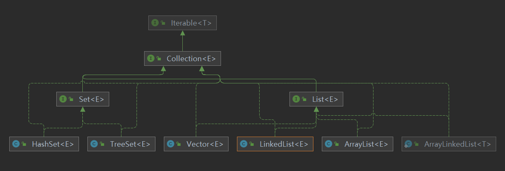

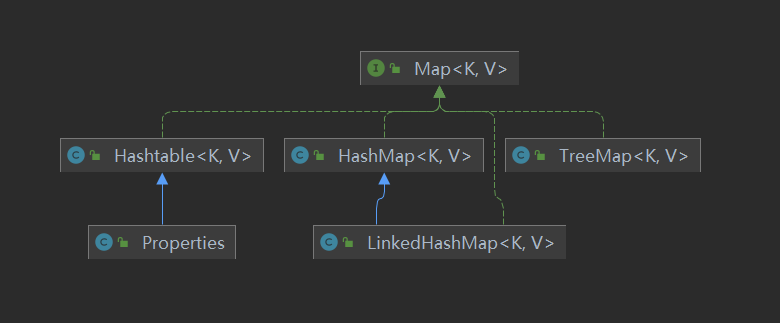

- 集合主要是两组，单列集合和双列集合
- Collection 接口又两个重要的子接口List 和 Set，他们的实现子类都是单列集合
- Map接口的实现子类是双列集合，存放K-V

### 2.1 Collection

Collection接口实现类的特点

- Collection实现子类可以存放多个元素，每个元素可以是Object
- 有些Collection的实现类可以存放重复的元素，有些不可以
- 有些Collection的实现类，有些是有序(List)，有些是无序的(Set)
- Collection接口没有直接的实现子类，是通过他的子接口List和Set来实现的

#### 2.1.1 Collection接口和常用方法

```java
package com.zcx.collection_;

import java.util.ArrayList;
import java.util.List;

@SuppressWarnings({"all"})
public class CollectionMethod {
    public static void main(String[] args) {
        List list = new ArrayList<>();
        // add:添加单个元素
        boolean b1 = list.add("jack");
        list.add(10);  // list.add(new Integer(10))
        list.add(true);
        System.out.println(list);
        // remove:删除指定元素
        boolean jack = list.remove("jack");// 指定删除jack
        Object remove = list.remove(0);// 删除第一个元素
        // contains:查找元素是否存在
        boolean b = list.contains("jack");
        System.out.println(b);
        // size:获取元素个数
        int i = list.size();
        System.out.println("元素个数" + i);
        // isEmpty:判断是否为空
        boolean b2 = list.isEmpty();
        // clear:清空,返回值为void
        list.clear();
        // addALL:添加多个元素
        List list1 = new ArrayList<>();
        list1.add(1);
        list1.add(2);
        list1.add(3);
        list.addAll(list1);
        System.out.println(list);
        // containsAll:查找多个元素是否存在
        boolean b3 = list.containsAll(list1);
        System.out.println(b3);
        // removeAll:删除多个元素
        list.add(4);
        list.removeAll(list1);
        System.out.println(list);
    }
}
```

#### 2.1.2 Collection接口遍历元素方式一------使用迭代器Iterator

- Iterator对象称为迭代器，主要用于遍历Collection集合中的元素

- 所有实现了Collection接口的集合类都有一个Iterator()方法，用以放回一个实现了Iterator接口的对象，即可以返回一个迭代器

- Iterator的结构如图所示

- Iterator仅用于遍历集合，本身并不存放对象

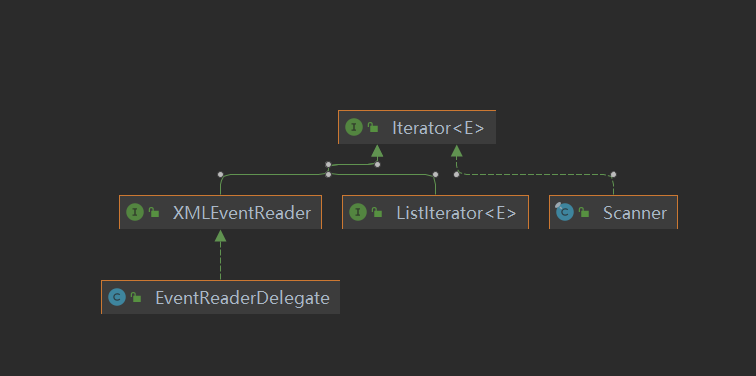

迭代器的执行原理：

```java
// 得到一个集合的迭代器
Iterator iterator = coll.iterator();
// hasNext()判断是否还有下一个元素
while (iterator.hasNext()){
    // next()
    // 1.指针下移
    // 2.将下移以后的集合位置上的元素返回
    System.out.println(iterator.next());
}
```

Iterator接口的方法

```java
/*
* 调用iterator.next()方法之前必须调用hasNext()方法，进行检测，若不调用，且吓一条记录无效，直接调用iterator.next()会抛出异常
* NoSuchElementException异常
*/
boolean hasNext();
E next();
void remove();
```

```java
package com.zcx.collection_;

import java.util.ArrayList;
import java.util.Collection;
import java.util.Iterator;

@SuppressWarnings({"all"})
public class CollectionIterator {
    public static void main(String[] args) {
        Collection coll = new ArrayList<>();
        coll.add(new Book("三国", "罗贯中", 10.1));
        coll.add(new Book("水浒", "施耐庵", 8.1));
        coll.add(new Book("红楼", "曹雪芹", 11.1));
        System.out.println(coll);

        Iterator iterator = coll.iterator();
        // itit
        while (iterator.hasNext()){
            // 返回object，编译类型是object，运行类型是book
            Object book = iterator.next();
            System.out.println(book);
        }

        // 推出while循环后，iterator迭代器指向最后的元素
        // 如果希望再次遍历，我们要重置迭代器
        iterator = coll.iterator();
        while (iterator.hasNext()){
            // 返回object，编译类型是object，运行类型是book
            Object book = iterator.next();
            System.out.println(book);
        }
    }
}

class Book {
    private String name;
    private String author;
    private double price;

    public Book(String name, String author, double price) {
        this.name = name;
        this.author = author;
        this.price = price;
    }

    public String getName() {
        return name;
    }

    public void setName(String name) {
        this.name = name;
    }

    public String getAuthor() {
        return author;
    }

    public void setAuthor(String author) {
        this.author = author;
    }

    public double getPrice() {
        return price;
    }

    public void setPrice(double price) {
        this.price = price;
    }

    @Override
    public String toString() {
        return "Book{" +
                "name='" + name + '\'' +
                ", author='" + author + '\'' +
                ", price=" + price +
                '}';
    }
}
```

#### 2.1.3 Collection接口遍历对象方式二----增强for循环

增强for循环，可以代替iterator迭代器，特点：

- 简化版iterator
- 只能用于遍历集合或数组

基本语法：

```java 
// for (元素类型 元素名 ： 集合名或数组名){
//     访问元素
// }
for (Object o : coll){
    System.out.println(o);
}
```

### 2.2 List

list接口基本介绍：

List接口是Collection接口的子接口

- List集合类中的元素有序，即添加顺序和取出顺序一致，且可重复
- List集合中的的每个元素都有其对应的顺序索引，即支持索引
- List容器中的元素都对应一个整数型的序号记载其在容器中的位置，可以根据序号存取容器中的元素
- JDK API中List接口的常用实现类有：ArrayList、Vector、LinkedList等等

```java
package com.zcx.collection_.list_;

import java.util.ArrayList;
import java.util.List;

@SuppressWarnings({"all"})
public class List01 {
    public static void main(String[] args) {
        // 1.List集合类中的元素有序，即添加顺序和取出顺序一致，且可重复
        List list = new ArrayList();
        list.add("jack");
        list.add("tom");
        list.add("john");
        list.add("zcx");
        list.add("zcx");
        System.out.println(list);
        // 2.List集合中的的每个元素都有其对应的顺序索引，即支持索引
        Object o = list.get(3);
        System.out.println(o);
    }
}
```

#### 2.2.1 List接口和常用方法

```java
package com.zcx.collection_.list_;

import java.util.ArrayList;
import java.util.List;

@SuppressWarnings({"all"})
public class ListMethod01 {
    public static void main(String[] args) {
        List list = new ArrayList();
        list.add("jack");
        list.add("tom");
        list.add("john");
        list.add("zcx");
        list.add("zcx");
        // 1.void add(int index, Object ele):在index位置插入ele元素
        list.add(2, "zlx");
        System.out.println(list);
        // 2.boolean addAll(int index, Collection coll):在index位置开始将coll中所有的元素插入进来
        List list1 = new ArrayList();
        list1.add(1);
        list1.add(2);
        list1.add(3);
        boolean b = list.addAll(1, list1);
        System.out.println(list);
        // 3.Object get(int index):获取指定位置的元素
        Object o1 = list.get(5);
        System.out.println(o1);
        // 4.int indexOf(Object obj):返回obj在集合中首次出现的位置,没有则返回-1
        int i1 = list.indexOf("zlx");
        int i2 = list.indexOf("hhh");
        System.out.println(i1);
        System.out.println(i2);
        // 5.int lastIndexOf(Object obj):返回obj在集合中末次出现的位置,没有则返回-1
        int i3 = list.lastIndexOf("zcx");
        int i4 = list.lastIndexOf("hhh");
        System.out.println(i3);
        System.out.println(i4);
        // 6.Object remove(int index):移除指定位置的元素，并返回该元素
        Object o2 = list.remove(0);
        System.out.println(o2);
        System.out.println(list);
        // 7.Object set(int index, Object ele):设置指定位置的元素为ele，相当于替换,同时返回该位置原来的元素
        Object o3 = list.set(1, "jack");
        System.out.println(o3);
        System.out.println(list);
        // 8.List subList(int fromIndex, int ToIndex):返回从fromIndex到ToIndex的子集合
        List list2 = list.subList(1, 3); // [1,3)
        System.out.println(list2);
    }
}
```

#### 2.2.2 遍历List的三种方式

```java
package com.zcx.collection_.list_;

import java.util.Iterator;
import java.util.LinkedList;
import java.util.List;

@SuppressWarnings({"all"})
public class ListFor {
    public static void main(String[] args) {
        List list = new LinkedList<>();
        list.add("jack");
        list.add("tom");
        list.add("john");

        // 1.iterator
        Iterator iterator = list.iterator();
        while (iterator.hasNext()) {
            Object next =  iterator.next();
            System.out.println(next);
        }

        // 增强for
        for (Object o: list
             ) {
            System.out.println(o);
        }

        // 3.for
        for (int i = 0; i < list.size(); i++) {
            Object o = list.get(i);
            System.out.println(o);
        }
    }
}
```

#### 2.2.3 排序

```java
package com.zcx.collection_.list_;

import java.util.ArrayList;
import java.util.Comparator;
import java.util.List;

@SuppressWarnings({"all"})
public class ListExercise02 {
    public static void main(String[] args) {
        List list = new ArrayList<>();
        list.add(new Book("红楼梦", 100, "曹雪芹"));
        list.add(new Book("西游记", 10, "吴承恩"));
        list.add(new Book("水浒传", 9, "施耐庵"));
        list.add(new Book("三国演义", 80, "吴承恩"));
        list.sort(new Comparator() {
            @Override
            public int compare(Object o1, Object o2) {
                Book o11 = (Book) o1;
                Book o21 = (Book) o2;
                double o1Price = o11.getPrice();
                double o2Price = o21.getPrice();
                return (int) (o1Price - o2Price);
            }
        });
        for (Object o : list
        ) {
            System.out.println(o);
        }
    }
}

class Book {
    private String name;
    private double price;
    private String authorName;

    public Book() {
    }

    @Override
    public String toString() {
        return "Book{" +
                "name='" + name + '\'' +
                ", price=" + price +
                ", authorName='" + authorName + '\'' +
                '}';
    }

    public Book(String name, double price, String authorName) {
        this.name = name;
        this.price = price;
        this.authorName = authorName;
    }

    public String getName() {
        return name;
    }

    public void setName(String name) {
        this.name = name;
    }

    public double getPrice() {
        return price;
    }

    public void setPrice(double price) {
        this.price = price;
    }

    public String getAuthorName() {
        return authorName;
    }

    public void setAuthorName(String authorName) {
        this.authorName = authorName;
    }
}
```

#### 2.2.4 ArrayList注意事项

- ArrayList可以加入所有的元素，包括null，并且可以重复
- ArrayList是由数组来实现数据存储的
- ArrayList基本等同于Vector，除了ArrayList是线程不安全的，执行效率高，在多线程的情况下，不建议是使用ArrayList

##### ArrayList扩容机制

- ArrayList中维护了一个Object类型的数组，elementData

```java
// transient修饰的变量不参与序列化和反序列化
transient Object[] elementData; // non-private to simplify nested class access
```

- 当创建对象时，

  - 如果使用的是无参构造器，则初始elementDate容量为0

  - ```java
    private static final Object[] DEFAULTCAPACITY_EMPTY_ELEMENTDATA = {};
    
    public ArrayList() {
        this.elementData = DEFAULTCAPACITY_EMPTY_ELEMENTDATA;
    }
    ```

  - 如果使用指定大小的构造器，则初始elementData容量为指定大小

  - ```java
    private static final Object[] EMPTY_ELEMENTDATA = {};
    
    public ArrayList(int initialCapacity) {
        if (initialCapacity > 0) {
            this.elementData = new Object[initialCapacity];
        } else if (initialCapacity == 0) {
            this.elementData = EMPTY_ELEMENTDATA;
        } else {
            throw new IllegalArgumentException("Illegal Capacity: "+
                                               initialCapacity);
        }
    }
    ```

- 当添加对象时，

  - 若使用无参构造器，则扩容elementData为10，如需要再次扩容，则扩容为elementData为1.5倍

  - ```java
    public boolean add(E e) {
        ensureCapacityInternal(size + 1);  // Increments modCount!!  size = 0;
        elementData[size++] = e;
        return true;
    }
    ```

  - ```java
    private static final int DEFAULT_CAPACITY = 10;
    
    protected transient int modCount = 0;
    
    private static int calculateCapacity(Object[] elementData, int minCapacity) {
        if (elementData == DEFAULTCAPACITY_EMPTY_ELEMENTDATA) {
            return Math.max(DEFAULT_CAPACITY, minCapacity);  // minCapacity = 1
        }
        return minCapacity;   // minCapacity = 10;
    }
    
    // minCapacity = size + 1； 
    private void ensureCapacityInternal(int minCapacity) {
        ensureExplicitCapacity(calculateCapacity(elementData, minCapacity));
    }
    
    // 最小容量减去当前实际有的容量，若>0,说明容量不够，调用grow()方法扩容
    private void ensureExplicitCapacity(int minCapacity) {
        modCount++;   // 记录集合被修改的次数
    
        // overflow-conscious code
        if (minCapacity - elementData.length > 0)
            grow(minCapacity);
    }
    ```

    ```java
    private static final int MAX_ARRAY_SIZE = Integer.MAX_VALUE - 8;
    
    @Native public static final int   MAX_VALUE = 0x7fffffff;   // 2^(31)-1.
    
    private void grow(int minCapacity) {
        // overflow-conscious code
        int oldCapacity = elementData.length;  // 0
        int newCapacity = oldCapacity + (oldCapacity >> 1);   // 1.5 * oldCapacity = 0
        if (newCapacity - minCapacity < 0)
            newCapacity = minCapacity;    // 如果新的容量比minCapacity小，则新容量等于minCapacity
        if (newCapacity - MAX_ARRAY_SIZE > 0)
            newCapacity = hugeCapacity(minCapacity);
        // minCapacity is usually close to size, so this is a win:
        elementData = Arrays.copyOf(elementData, newCapacity);   
    }
    // 十个元素全为null，若是空间不够扩容，则10个值，后面5个元素为空。
    ```

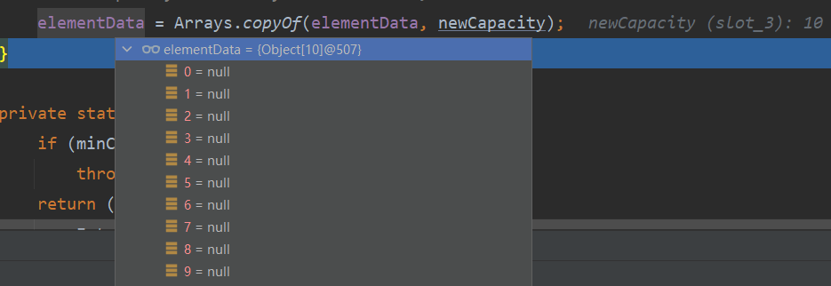

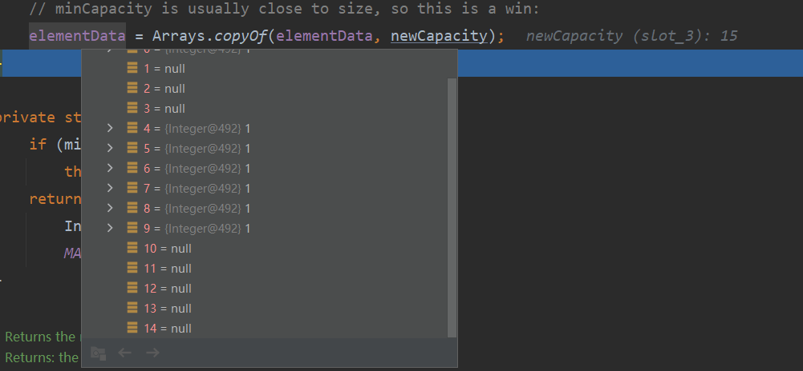

- ```java
  // 赋值成功后，第一个元素添加成功
  ```

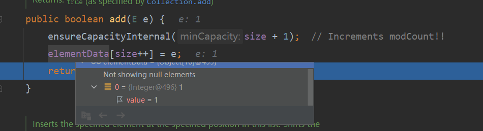

- 
  - 如果使用指定大小的构造器，扩容直接1.5倍扩容  

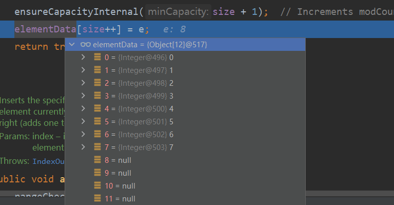


##### Vector的扩容机制

- Vector中维护一个object类型的elementData数组

- ```java
  protected Object[] elementData;
  ```

- 当创建对象时，

  - 如果使用的是无参构造器，默认空间是10

  - ```java
    public Vector() {
        this(10);
    }
    ```

  - 如果使用的指定大小的构造器创建，则就是指定大小

  - ```java
    public Vector(int initialCapacity) {
        this(initialCapacity, 0);
    }
    ```

- 当添加对象时，若需要扩容，则 每次看2倍扩容

  - ```java
    public synchronized boolean add(E e) {
        modCount++;
        ensureCapacityHelper(elementCount + 1);
        elementData[elementCount++] = e;
        return true;
    }
    ```

    ```java
    private void ensureCapacityHelper(int minCapacity) {
        // overflow-conscious code
        if (minCapacity - elementData.length > 0)
            grow(minCapacity);
    }
    ```

    ```java
    private void grow(int minCapacity) {
        // overflow-conscious code
        int oldCapacity = elementData.length;
        int newCapacity = oldCapacity + ((capacityIncrement > 0) ?
                                         capacityIncrement : oldCapacity);
        if (newCapacity - minCapacity < 0)
            newCapacity = minCapacity;
        if (newCapacity - MAX_ARRAY_SIZE > 0)
            newCapacity = hugeCapacity(minCapacity);
        elementData = Arrays.copyOf(elementData, newCapacity);
    }
    ```

#### 2.2.5 LinkedList

- LinkedList底层实现了双向链表和双端队列

  - LinkedList中维护了两个属性，first和last分别指向首节点和尾节点
  - 每个节点（Node）对象，里面又维护了prev、next、item三个属性，其中通过prev指向前一个，通过next指向后一个节点，最终实现双向链表
  - LinkedList的元素的添加和删除不是通过数组完成的，相对来说效率较高

- 可以添加任意元素，元素可以重复，包括null

- 线程不安全，没有实现同步

  

##### 双向链表模拟

```java
package com.zcx.collection_.list_;

@SuppressWarnings({"all"})
public class LinkedList {
    public static void main(String[] args) {
        Node jack = new Node("jack");
        Node tom = new Node("tom");
        Node john = new Node("john");

        // 连结三个节点，形成双向链表
        jack.next = tom;
        tom.prev = jack;
        tom.next = john;
        john.prev = tom;

        Node first = jack;
        Node last = john;

        // 从头到尾的遍历
        while (true) {
            if (first == null) {
                break;
            } else {
                System.out.println(first);
                first = first.next;  // john的next为null
            }
        }

        // 从尾到头的遍历
        while (true) {
            if (last == null) {
                break;
            } else {
                System.out.println(last);
                last = last.prev;
            }
        }

        // 插入一个对象
        Node susun = new Node("susun");
        susun.next = john;
        john.prev = susun;
        tom.next = susun;
        susun.prev = tom;

        first = jack;

        while (true) {
            if (first == null) {
                break;
            } else {
                System.out.println(first);
                first = first.next;  // john的next为null
            }
        }
    }
}

class Node {
    public Node prev;
    public Node next;
    public Object item;

    public Node(Object name) {
        this.item = name;
    }

    @Override
    public String toString() {
        return "Node{" +
                "item=" + item +
                '}';
    }
}
```

##### LinkedList底层源码解读

- 创建LinkedList对象

  ```java
  public LinkedList() {
  }
  ```

- 增加

  ```java
  public boolean add(E e) {
      linkLast(e);
      return true;
  }
  ```

  ```java
  private static class Node<E> {
      E item;
      Node<E> next;
      Node<E> prev;
  
      Node(Node<E> prev, E element, Node<E> next) {
          this.item = element;
          this.next = next;
          this.prev = prev;
      }
  }
  ```

  ```java
  // 创建LinkedList对象后，linkedList的first、last、size都为空
  // 添加第一个元素
  void linkLast(E e) {
      final Node<E> l = last;  // l = last = null
      final Node<E> newNode = new Node<>(l, e, null);  // newNode--->(null, e, null)
      last = newNode;   // last指向newNode
      if (l == null)    // l = null 所以 first也指向newNode
          first = newNode;
      else
          l.next = newNode;
      size++;   // size=1
      modCount++;
  }
  ```

  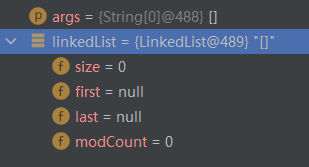

  ​																		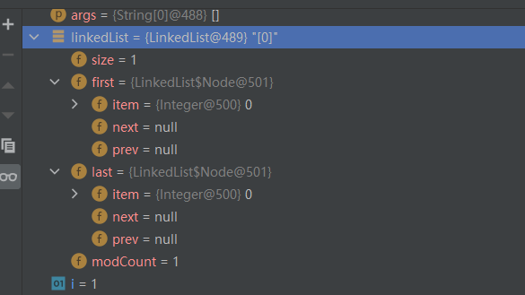

```java
// 添加第二个元素
void linkLast(E e) {
    final Node<E> l = last;   // L = last 指向第一个几点
    final Node<E> newNode = new Node<>(l, e, null);  // newNode.prev 指向第一个节点
    last = newNode;      // last 指向newNode
    if (l == null)       
        first = newNode;
    else                 // l不为null，原本l指向第一个节点，现在使得第一个节点指向newNode
        l.next = newNode;
    size++;
    modCount++;
}
// first指向第一个节点，last指向newNode
```

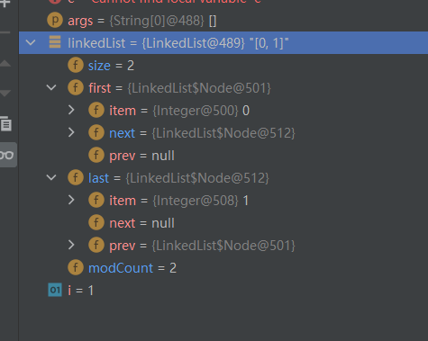

- 删除

- ```java
  // 默认删除第一个节点java
  public E remove() {
      return removeFirst();
  }
  
  public E removeFirst() {
      final Node<E> f = first;
      if (f == null)
          throw new NoSuchElementException();
      return unlinkFirst(f);
  }
  
  private E unlinkFirst(Node<E> f) {
      // assert f == first && f != null;
      final E element = f.item;
      final Node<E> next = f.next;
      f.item = null;  // 使要删除节点的item为null
      f.next = null; //  next也指向null
      first = next;  // first指向下一个节点
      if (next == null)  // 如果只有一个节点，那么last，first都为null
          last = null;
      else    // 下一个节点的prev指向null
          next.prev = null;
      size--;
      modCount++;
      return element;
  }
  ```

- ```java
  public E remove(int index) {
      checkElementIndex(index); // 检查index的合法性
      return unlink(node(index));
  }
  
  private void checkElementIndex(int index) {
      if (!isElementIndex(index))
          throw new IndexOutOfBoundsException(outOfBoundsMsg(index));
  }
  
  private boolean isElementIndex(int index) {
      return index >= 0 && index < size;
  }
  
  E unlink(Node<E> x) {
      // assert x != null;
      final E element = x.item;   // 
      final Node<E> next = x.next;
      final Node<E> prev = x.prev;
  
      if (prev == null) {
          first = next;
      } else {
          prev.next = next;  // 上一个节点next指向下一个节点
          x.prev = null;	  // 本节点的prev指向null
      }
  
      if (next == null) {
          last = prev;
      } else {
          next.prev = prev;   // 下一个节点的prev指向上一个节点
          x.next = null;     // 本节点的next指向null
      }
  
      x.item = null;        // 本节点的值为null 
      size--;				 // size 减一
      modCount++;
      return element;    // 返回删除的元素
  }
  
  ```

#### 2.2.6 集合选择

- ArrayList和Vector的比较

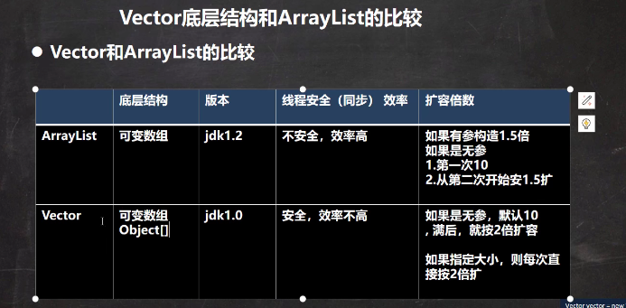

- ArrayList和LinkedList比较

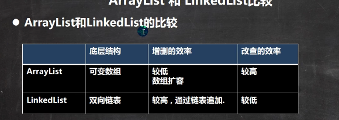


### 2.3 Set

- 无序，（添加的顺序和取出的顺序不一致，但顺序是固定的），没有索引

- 不允许重复元素，最多包含一个null

  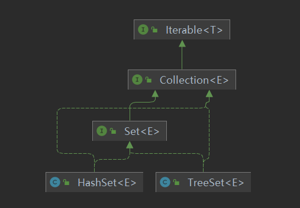

#### 2.3.1 Set接口和常用方法

- 和List接口一样，Set接口也是Collection接口的子接口，因此，常用方法和Collection接口一样
- Set接口的遍历方式同Collection接口一样
  - 可以使用迭代器
  - 可以使用增强for
  - 不能使用索引的方式获取

```java
package com.zcx.collection_.set_;

import java.util.HashSet;
import java.util.Iterator;
import java.util.Set;

@SuppressWarnings({"all"})
public class SetMethod {
    public static void main(String[] args) {
        // 1.以set接口的实现子类HashSet来讲解Set接口的 方法
        // 2.不可以存放重复的元素，可以添加null
        // 3.无序，添加的顺序和取出的顺序不一致，但是取出的顺序的固定的
        Set set = new HashSet<>();
        set.add("zcx");
        set.add("zcx");
        set.add("hello");
        System.out.println(set);

        Iterator iterator = set.iterator();
        while (iterator.hasNext()) {
            Object next = iterator.next();
            System.out.println(next);
        }

        for (Object o : set
        ) {
            System.out.println(o);
        }
    }
}
```

#### 2.3.2 HashSet全面说明

- HashSet实现了Set接口

- HashSet实际上就是HashMap

- ```java
  public HashSet() {
      map = new HashMap<>();
  }
  ```

- ```java
  static final float DEFAULT_LOAD_FACTOR = 0.75f;
  
  public HashMap() {
      this.loadFactor = DEFAULT_LOAD_FACTOR; // all other fields defaulted
  }
  ```

- 可以存放null值，但是只能有一个null

- Hash不保证元素是有序的，取决于hash后，再确定索引的结果

- 不能有重复的对象

```java
package com.zcx.collection_.set_;

import java.util.HashSet;
import java.util.Set;

public class HashSet01 {
    public static void main(String[] args) {
        Set set = new HashSet<>();
        set.add(null);
        set.add(null);
        set.add("hello world");    // 添加成功
        set.add("hello world");    // 添加失败
        set.add(new Dog("tom"));   // 添加成功
        set.add(new Dog("tom"));   // 添加成功
        System.out.println(set);
        
        set.add(new String("zcx")); // ok
        set.add(new String("zcx")); // failure  hashcode一样
        
    }
}

class Dog{
    private String name;

    public Dog(String name) {
        this.name = name;
    }
}
```

##### HashSet底层机制模拟

HashSet底层是HashMap，HashMap底层是（数组 + 链表 + 红黑树）

```java
package com.zcx.collection_.set_;

public class HashSetStructure {
    public static void main(String[] args) {
        // 创建数组，数组类型是Node
        Node[] table = new Node[16];
        System.out.println(table);
        // 创建结点
        Node zcx = new Node("zcx", null);
        table[2] = zcx;

        Node jack = new Node("jack", null);
        // 将jack结点挂载到zcx
        zcx.next = jack;
        System.out.println(table);
    }
}

// 结点，存储数据，可以指向下一个结点，从而形成链表
class Node {
    Object item;
    Node next;

    public Node(Object item, Node next) {
        this.item = item;
        this.next = next;
    }
}
```

##### **HashSet底层源码解读**

- 添加
  - 添加一个元素时，首先获得hash值，会转成索引值
  - 找到存储数据表table，看这个索引位置是否已经存放有元素
  - 如果没有直接加入
  - 如果有，调用equals比较，如果相同，放弃添加；如果不相同，则添加到最后
  - 在Java8中，如果一条链表的元素个数超过TREEIFY_THRESHOLD(默认是8)，并且table的大小 >= MIN_TREEIFY_CAPACITY(默认是64)，就会进化成红黑树

```java
private static final Object PRESENT = new Object();  // 常量对象

public boolean add(E e) {
    return map.put(e, PRESENT)==null;
}
```

```java
int threshold;

public V put(K key, V value) {
    return putVal(hash(key), key, value, false, true);
}

final V putVal(int hash, K key, V value, boolean onlyIfAbsent,
               boolean evict) {
    Node<K,V>[] tab; Node<K,V> p; int n, i;
    if ((tab = table) == null || (n = tab.length) == 0)
        n = (tab = resize()).length;  // n = 16
    if ((p = tab[i = (n - 1) & hash]) == null)   // 结点p根据hash值得到索引，如果索引的位置为空，创建一个新结点，把hash，key，value填进去
        tab[i] = newNode(hash, key, value, null);
    else {
        Node<K,V> e; K k;
        if (p.hash == hash &&
            ((k = p.key) == key || (key != null && key.equals(k))))   // 如果位置结点p的hash与添加的结点hash值相等，key也相等
            e = p;                                                    // 使得 e = p；
        else if (p instanceof TreeNode)
            e = ((TreeNode<K,V>)p).putTreeVal(this, tab, hash, key, value);
        else {
            for (int binCount = 0; ; ++binCount) {
                if ((e = p.next) == null) {
                    p.next = newNode(hash, key, value, null);
                    if (binCount >= TREEIFY_THRESHOLD - 1) // -1 for 1st
                        treeifyBin(tab, hash);
                    break;
                }
                if (e.hash == hash &&
                    ((k = e.key) == key || (key != null && key.equals(k))))
                    break;
                p = e;
            }
        }
        if (e != null) { // existing mapping for key
            V oldValue = e.value;
            if (!onlyIfAbsent || oldValue == null)
                e.value = value;
            afterNodeAccess(e);
            return oldValue;
        }
    }
    ++modCount;
    if (++size > threshold)
        resize();
    afterNodeInsertion(evict);
    return null;
}

static final int DEFAULT_INITIAL_CAPACITY = 1 << 4; // aka 16

final Node<K,V>[] resize() {
    Node<K,V>[] oldTab = table;   // oldTab:null     table:null
    int oldCap = (oldTab == null) ? 0 : oldTab.length;   // oldCap = 0;
    int oldThr = threshold;  // oldThr = 0
    int newCap, newThr = 0;  // newCap = newThr = 0
    if (oldCap > 0) {
        if (oldCap >= MAXIMUM_CAPACITY) {
            threshold = Integer.MAX_VALUE;
            return oldTab;
        }
        else if ((newCap = oldCap << 1) < MAXIMUM_CAPACITY &&
                 oldCap >= DEFAULT_INITIAL_CAPACITY)
            newThr = oldThr << 1; // double threshold
    }
    else if (oldThr > 0) 
        newCap = oldThr;
    else {             
        newCap = DEFAULT_INITIAL_CAPACITY;   // newCap = 16
        newThr = (int)(DEFAULT_LOAD_FACTOR * DEFAULT_INITIAL_CAPACITY);   // newThr = 16 * 0.75 = 12  临界因子
    }
    if (newThr == 0) {
        float ft = (float)newCap * loadFactor;
        newThr = (newCap < MAXIMUM_CAPACITY && ft < (float)MAXIMUM_CAPACITY ?
                  (int)ft : Integer.MAX_VALUE);
    }
    threshold = newThr;   // threshode = 12;
    @SuppressWarnings({"rawtypes","unchecked"})
    Node<K,V>[] newTab = (Node<K,V>[])new Node[newCap];
    table = newTab;
    if (oldTab != null) {
        for (int j = 0; j < oldCap; ++j) {
            Node<K,V> e;
            if ((e = oldTab[j]) != null) {
                oldTab[j] = null;
                if (e.next == null)
                    newTab[e.hash & (newCap - 1)] = e;
                else if (e instanceof TreeNode)
                    ((TreeNode<K,V>)e).split(this, newTab, j, oldCap);
                else { // preserve order
                    Node<K,V> loHead = null, loTail = null;
                    Node<K,V> hiHead = null, hiTail = null;
                    Node<K,V> next;
                    do {
                        next = e.next;
                        if ((e.hash & oldCap) == 0) {
                            if (loTail == null)
                                loHead = e;
                            else
                                loTail.next = e;
                            loTail = e;
                        }
                        else {
                            if (hiTail == null)
                                hiHead = e;
                            else
                                hiTail.next = e;
                            hiTail = e;
                        }
                    } while ((e = next) != null);
                    if (loTail != null) {
                        loTail.next = null;
                        newTab[j] = loHead;
                    }
                    if (hiTail != null) {
                        hiTail.next = null;
                        newTab[j + oldCap] = hiHead;
                    }
                }
            }
        }
    }
    return newTab;
}

Node<K,V> newNode(int hash, K key, V value, Node<K,V> next) {
    return new Node<>(hash, key, value, next);
}
```


## 3、反射

```properties
classfullpath=com.zcx.Cat
method = hi
```

```java
package com.zcx.reflection.question;

import com.zcx.Cat;

import java.io.FileInputStream;
import java.io.IOException;
import java.lang.reflect.InvocationTargetException;
import java.lang.reflect.Method;
import java.util.Properties;

/**
 * @author zhengchuxuan
 * 发射问题的引入
 */
public class ReflectionQuestion {
    public static void main(String[] args) throws IOException, ClassNotFoundException, InstantiationException, IllegalAccessException, NoSuchMethodException, InvocationTargetException {
        // 传统的方式
        Cat cat = new Cat();
        cat.hi();
        // 使用propeties类
        Properties properties = new Properties();
        properties.load(new FileInputStream("src\\re.properties"));
        String classfullpath = properties.get("classfullpath").toString();
        String method = properties.get("method").toString();
        System.out.println(classfullpath);
        System.out.println(method);

        // 使用反射机制解决
        // 1. 加载类,返回Class类型的对象
        Class<?> cls = Class.forName(classfullpath);
        // 2.通过cls得到加载的类com.zcx.Cat的对象实例
        Object o = cls.newInstance();
        System.out.println("o的运行类型" + o.getClass());
        // 3.通过cls得到加载的类com.zcx.Cat的methodName方法对象
        //  即在反射中，可以把方法视为对象
        Method clsMethod = cls.getMethod(method);
        // 通过clsMethod调用方法：即通过方法对象来调用方法
        // 传统方法：对象.方法()  反射机制：方法.invoke(对象)
        clsMethod.invoke(o);
    }
}
```

Java Reflection：

- 反射机制运行程序在执行期间借助于Reflection API取得任何类的内部信息（比如成员变量、构造器、成员方法等），并能操作对象的属性及方法。反射在设计模式和框架底层都会用到。

- 加载完类后，在堆中就产生了一个Class类型的对象（一个类只有一个Class对象），这个对象包含了类的完整结构信息。通过这个对象得到类的结构。这个对象就像一面镜子，透过这个镜子看到类的结构，所以形象的称为反射。

- P对象--->类型是Person类

  对象cls---> 类型是Class


Java反射机制可以完成：

- 运行时判断任意一个对象所属的类
- 运行时构造任意一个类的对象
- 运行时得到任何一个类所具有的成员变量和方法
- 运行时调用任意一个对象的成员变量和方法
- 生成动态代理

反射相关的主要类：

- java.lang.Class:代表一个类，Class对象表示某个类加载后在堆中的对象
- java.lang.reflect.Method:代表类的方法
- java.lang.reflect.Field:代表类的成员变量
- java.lang.reflect.Constructor:代表类的构造器

```java
package com.zcx.reflection;

import java.io.FileInputStream;
import java.lang.reflect.Constructor;
import java.lang.reflect.Field;
import java.lang.reflect.Method;
import java.util.Properties;

public class Reflection01 {
    public static void main(String[] args) throws Exception {
        Properties properties = new Properties();
        properties.load(new FileInputStream("src\\re.properties"));
        String classfullpath = properties.get("classfullpath").toString();
        String method = properties.get("method").toString();

        // 使用反射机制解决
        // 1. 加载类,返回Class类型的对象
        Class<?> cls = Class.forName(classfullpath);
        // 2.通过cls得到加载的类com.zcx.Cat的对象实例
        Object o = cls.newInstance();
        System.out.println("o的运行类型" + o.getClass());
        // 3.通过cls得到加载的类com.zcx.Cat的methodName方法对象
        //  即在反射中，可以把方法视为对象
        Method clsMethod = cls.getMethod(method);
        // 通过clsMethod调用方法：即通过方法对象来调用方法
        // 传统方法：对象.方法()  反射机制：方法.invoke(对象)
        clsMethod.invoke(o);

        // java.lang.reflect.Field:代表类的成员变量
        // getField()不能得到私有的属性
        Field age = cls.getField("age");
        System.out.println(age.get(o));

        // java.lang.reflect.Constructor:代表类的构造器
        // ()中可以指定构造器参数类型，默认返回无参构造器
        Constructor<?> constructor = cls.getConstructor();
        System.out.println(constructor);

        // String.class就是String的Class对象
        Constructor<?> constructor1 = cls.getConstructor(String.class);
        System.out.println(constructor1);

        Constructor<?> constructor2 = cls.getConstructor(int.class);
        System.out.println(constructor2);
    }
}
```

反射的优点和缺点：

- 优点：可以动态的创建和使用对象，使用灵活，没有反射机制，框架技术就失去了底层支持
- 缺点：使用反射基本是解释执行的，对执行速度有影响

```java
package com.zcx.reflection;

import com.zcx.Cat;

import java.lang.reflect.Method;

public class Reflection02 {
    public static void main(String[] args) throws Exception {
        Reflection02 reflection02 = new Reflection02();
        reflection02.m1();
        reflection02.m2();
    }
    // 传统方法
    public void m1(){
        Cat cat = new Cat();
        long start = System.currentTimeMillis();
        for (int i = 0; i < 90000000; i++) {
            cat.hi();
        }
        long end = System.currentTimeMillis();
        System.out.println(end - start);
    }
    // 反射机制
    public void m2() throws Exception {
        Class<?> cat = Class.forName("com.zcx.Cat");
        Object o = cat.newInstance();
        Method method = cat.getMethod("hi");
        long start = System.currentTimeMillis();
        for (int i = 0; i < 90000000; i++) {
            method.invoke(o);
        }
        long end = System.currentTimeMillis();
        System.out.println(end - start);
    }
}
```

反射调用优化-关闭访问检查

- Method和Field、Constructor对象都有setAccessible()方法
- setAccessible作用是启动和禁止访问安全检查的开关
- 参数值为true表示反射对象在使用时取消访问检查，提高反射的效率。参数值为false则表示反射的对象执行访问检查

### 3.1 Class


- Class也是类，因此也继承Object类
- Class类对象表示new出来的，是系统创建出来的
- 对于某个类的Class对象，在内存中只有一份，因此类只加载一次
- 每个类的实例都会记得自己由哪个Class实例所生成
- 通过Class可以得到一个类的完整结构，通过一系列API
- Class对象存放在堆中
- 类的字节码二进制文件是放在方法区的，有的地方成为元数据（包括方法代码、变量名、方法名、访问权限等等）

```java
package com.zcx.reflection.class_;

import com.zcx.Cat;

public class Class01 {
    public static void main(String[] args) throws ClassNotFoundException {
        // Class类图
        // 1.Class也是类，因此也继承Object类
        // 2.Class类对象表示new出来的，是系统创建出来的
        // (1)传统new对象
        /*  ClassLoader类
            public Class<?> loadClass(String name) throws ClassNotFoundException {
                return loadClass(name, false);
             }
        */
        Cat cat = new Cat();
        // (2)反射方式
        /*  public Class<?> loadClass(String name) throws ClassNotFoundException {
                return loadClass(name, false);
             }
        */
        Class<?> cls1 = Class.forName("com.zcx.Cat");

        // 3.对于某个类的Class对象，在内存中只有一份，因此类只加载一次
        Class<?> cls2 = Class.forName("com.zcx.Cat");
        System.out.println(cls1.hashCode());
        System.out.println(cls2.hashCode());
        Class<?> cls3 = Class.forName("com.zcx.Dog");
        System.out.println(cls3.hashCode());
        
        // 类的字节码二进制文件是放在方法区的，有的地方成为元数据（包括方法代码、变量名、方法名、访问权限等等）
    }
}
```

Class类的常用方法


```java
package com.zcx.reflection.class_;

import java.lang.reflect.Field;

public class Class02 {
    public static void main(String[] args) throws Exception {
        String classAllPath = "com.zcx.Car";
        // 1.获取Car类对应的Class对象
        Class<?> cls = Class.forName(classAllPath);
        // 2.输出cls，显示cls对象是属于哪个类的Class对象
        System.out.println(cls);
        // 输出cls的运行类型
        System.out.println(cls.getClass());
        // 3.得到包名
        System.out.println(cls.getPackage().getName());
        // 4.得到全类名
        System.out.println(cls.getName());
        // 5.通过cls创建对象实例
        Object o = cls.newInstance();
        System.out.println(o);
        // 6.通过反射获取属性brand
        Field brand = cls.getField("brand");
        System.out.println(brand.get(o));
        // 7.通过反射给属性赋值
        brand.set(o,"audi");
        System.out.println(brand.get(o));
        // 8.获取所有的属性
        Field[] fields = cls.getFields();
        for (Field f: fields
             ) {
            System.out.println(f.getName() + ":" + f.get(o));

        }
    }
}
```

### 3.2 获取Class对象的六种方式

```java
package com.zcx.reflection.class_;

import com.zcx.Car;

public class GetClass {
    public static void main(String[] args) throws Exception {
        // 1.Class.forName(),通过读取配置文件获取
        Class<?> cls1 = Class.forName("com.zcx.Car");
        System.out.println(cls1);

        // 2.类名.class，多用于参数传递
        Class<Car> cls2 = Car.class;
        System.out.println(cls2);

        // 3.对象.getClass()，用于已经有对象实例
        Car car = new Car();
        Class<? extends Car> cls3 = car.getClass();
        System.out.println(cls3);

        // 4.通过类加载器[4种]获取到类的Class对象
        // (1)先得到类加载器 car
        ClassLoader classLoader = car.getClass().getClassLoader();
        // (2)通过类加载器得到Class对象
        Class<?> cls4 = classLoader.loadClass("com.zcx.Car");
        System.out.println(cls4);

        System.out.println(cls1.hashCode());
        System.out.println(cls2.hashCode());
        System.out.println(cls3.hashCode());
        System.out.println(cls4.hashCode());

        // 5.基本数据按如下方式得到Classs对象
        Class<Integer> integerClass = int.class;
        Class<Character> characterClass = char.class;
        Class<Boolean> booleanClass = boolean.class;
        System.out.println(integerClass);
        System.out.println(characterClass);
        System.out.println(booleanClass);

        // 6.基本数据类型对应的包装类，可以通过 包装类.TYPE得到Class对象
        Class<Integer> type1 = Integer.TYPE;
        Class<Character> type2 = Character.TYPE;
        Class<Boolean> type3 = Boolean.TYPE;
        System.out.println(type1);
        System.out.println(type2);
        System.out.println(type3);

        System.out.println(integerClass.hashCode());
        System.out.println(type1.hashCode());

    }
}
```

如下类型有Class对象

- 外部类，成员内部类，静态内部类，局部内部类，匿名内部类
- interface：接口
- 数组
- enum：枚举
- annotation：注解
- 基本数据类型
- void  

```java
package com.zcx.reflection.class_;

public class AllTypeClass {
    public static void main(String[] args) {
        Class<String> cls1 = String.class;
        Class<Iterable> cls2 = Iterable.class;
        Class<Integer[]> cls3 = Integer[].class;
        Class<float[][]> cls4 = float[][].class;
        Class<SuppressWarnings> cls5 = SuppressWarnings.class;
        Class<Integer> cls6 = int.class;
        Class<Void> cls7 = void.class;

        //枚举
        Class<Thread.State> cls8 = Thread.State.class;
        Class<Class> cls9 = Class.class;

        System.out.println(cls1);
        System.out.println(cls2);
        System.out.println(cls3);
        System.out.println(cls4);
        System.out.println(cls5);
        System.out.println(cls6);
        System.out.println(cls7);
        System.out.println(cls8);
        System.out.println(cls9);
    }
}
```

### 3.3 类加载

反射机制是java实现动态语言的关键，也就是通过反射实现类动态加载。

- 静态加载：编译时加载相关的类，如果没有则报错，依赖性太强
- 动态加载：运行时加载需要的类，如果运行时不用该类，则不报错，降低了依赖性

类加载时机：

- 创建对象时
- 当子类被加载，父类也被加载
- 调用类中的静态成员时
- 通过反射


- 加载阶段：JVM在该阶段的主要目的是将字节码从不同的数据源(可能是class文件，也可能是jar包，甚至网络)转化为二进制字节流加载到内存中，并生成一个代表该类的java.lang.Class对象
- 连接阶段-验证：
  - 目的是为了确保Class文件的字节流中包含的信息符合虚拟机的要求，并且不会危害虚拟机的安全
  - 包括：文件格式验证（是否以魔数oxcafebaba开头）、元数据验证、字节码验证和符号引用验证
  - 可以考虑使用-Xverify:none参数关闭大部分的类验证措施，缩短JVM虚拟机类加载的时间

- 连接阶段-准备：
  - JVM在该阶段对静态变量，分配内存并初始化（对应数据类型默认初始值）。这些变量所使用的内存都在方法区进行分配。

- 连接阶段-解析：
  - 虚拟机将常量池内的符号引用替换为直接引用的过程

```java
class A{
    // 属性
    // 1.n1是实例属性，不说静态变量，因此在准备阶段是不会分配内存
    // 2.n2是静态变量，分配内存，n2是默认初始化，值为0
    // 3.N3是static final，所以是常量，和静态变量不一样，因此一旦赋值就不会变了
    public int n1 = 10;
    public static int n2 = 20;
    public static final int N3 = 30;
}
```

- 初始化（Initialization）
  - 到初始化阶段，才真正开始执行类中定义的java程序代码，此阶段是执行<clinit>方法的过程
  - <cinit>方法是由编译器按语句在源文件中出现的顺序，依次自动收集类中所有的静态变量的赋值动作和静态代码块中的语句，并进行合并。
  - 虚拟机会保证一个类的<cinit>方法在多线程中被正确的加锁、同步，如果多个线程同时去初始化一个类，那么只会有一个线程去执行这个类的<cinit>方法，其他线程都需要阻塞等待，直到活线程执行<cinit>方法完毕

```java
package com.zcx.reflection.classload_;

public class ClassLoad03 {
    public static void main(String[] args) throws ClassNotFoundException {
        // 1.加载B类，生成B的Class对象
        // 2.连接 num = 0；
        // 3.初始化阶段
        /*
        *       cInit(){
        *           System.out.println("B 静态代码块被执行");
                    num = 300;
        *           num = 100;
        *       }
        *       合并：num = 100;
        *
        * */
//        System.out.println(B.num);
        B b = new B();


    }
}

class B{
    static{
        System.out.println("B 静态代码块被执行");
        num = 300;
    }

    static int num = 100;

    public B() {
        System.out.println("B 构造器被执行");
    }
}
```

### 3.4 获取类结构信息

```java
package com.zcx.reflection;

import org.junit.Test;

import java.lang.annotation.Annotation;
import java.lang.reflect.Constructor;
import java.lang.reflect.Field;
import java.lang.reflect.Method;

public class ReflectionUtils {
    public static void main(String[] args) {

    }

    @Test
    public void api_01() throws Exception {
        // 1.得到class对象
        Class<?> cls = Class.forName("com.zcx.reflection.Person");
        System.out.println("==========");

        // 2.getName:获取全类名
        String name = cls.getName();
        System.out.println(name);
        System.out.println("==========");

        // 3.getSimpleName:获取简单类名
        String simpleName = cls.getSimpleName();
        System.out.println(simpleName);
        System.out.println("==========");

        // 4.getFields:获取所有public修饰的属性，包括本类及父类
        Field[] fields = cls.getFields();
        for (Field field : fields
        ) {
            System.out.println(field + " + " + field.getName());
        }
        System.out.println("==========");

        // 5.getDeclaredFields:获取本类中的所有属性
        Field[] declaredFields = cls.getDeclaredFields();
        for (Field declaredField : declaredFields) {
            System.out.println(declaredField);
        }
        System.out.println("==========");

        // 6.getMethods:获取所有public修饰的方法，包括父类(父类的父类)和本类
        Method[] methods = cls.getMethods();
        for (Method method : methods) {
            System.out.println(method);
        }
        System.out.println("==========");

        // 7.getDeclaredMethods:获取本类的所有方法
        Method[] declaredMethods = cls.getDeclaredMethods();
        for (Method declaredMethod : declaredMethods) {
            System.out.println(declaredMethod);
        }
        System.out.println("==========");

        // 8.getConstructors：获取所有public修饰的构造器，包括本类
        Constructor<?>[] constructors = cls.getConstructors();
        for (Constructor<?> constructor : constructors) {
            System.out.println(constructor);
        }
        System.out.println("==========");

        // 9.getDeclaredConstructors:获取本类所有的构造器
        Constructor<?>[] declaredConstructors = cls.getDeclaredConstructors();
        for (Constructor<?> declaredConstructor : declaredConstructors) {
            System.out.println(declaredConstructor);
        }
        System.out.println("==========");

        // 10.getPackage:以Package形式返回包信息
        Package clsPackage = cls.getPackage();
        System.out.println(clsPackage);
        System.out.println("==========");

        // 11.以Class形式返回父类信息
        Class<?> superclass = cls.getSuperclass();
        System.out.println(superclass);
        System.out.println("==========");

        // 12.getInterfaces:以接口形式返回所有信息
        Class<?>[] interfaces = cls.getInterfaces();
        for (Class<?> anInterface : interfaces) {
            System.out.println(anInterface);
        }
        System.out.println("==========");

        // 13.getAnnotations:以Annotataions[]返回注解信息
        Annotation[] annotations = cls.getAnnotations();
        for (Annotation annotation : annotations) {
            System.out.println(annotation);
        }
    }
}

class A {
    public String hobby;

    public void m5() {

    }

    public A() {
    }

    public A(String hobby) {
        this.hobby = hobby;
    }
}

interface IA {

}

@SuppressWarnings({"all"})
@Deprecated
class Person extends A implements IA {
    // 属性
    public String name;
    protected int age;
    String job;
    private double salary;

    public Person() {
    }

    public Person(String name) {
        this.name = name;
    }

    public Person(String name, int age, String job, double salary) {
        this.name = name;
        this.age = age;
        this.job = job;
        this.salary = salary;
    }

    // 方法
    public void m1() {
        System.out.println("m1");
    }

    protected void m2() {
        System.out.println("m2");
    }

    void m3() {
        System.out.println("m3");
    }

    private void m4() {
        System.out.println("m4");
    }
}
```

