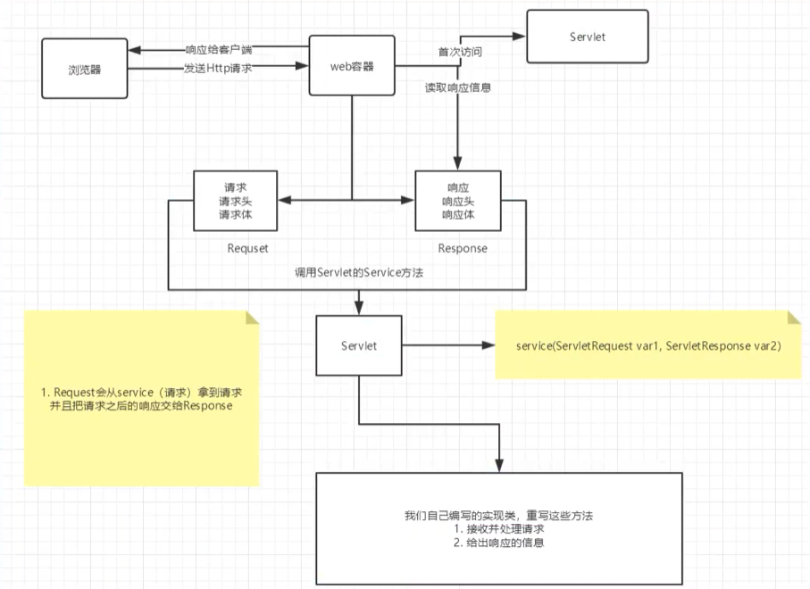

# JavaWeb

## 1、基本概念

### 1.1 前言

web开发：

- web，网页的意思
- 静态web
  - html，css
  - 提供给所有人看的数据，始终不会发生变化

- 动态web
  - 提供给所有人看的数据，始终会发生变化，不同的地点看到的信息各不相同
  - 技术栈：servlet/JSP，ASP，PHP 

在java中，动态web资源开发的技术统称为Javaweb

### 1.2 web应用程序

web应用程序：可以提供浏览器访问的程序

- a.html、b.html。。。多个web资源，这些web资源可以被外界访问，对外界提供该服务
- 你们能访问到任何一个页面或者资源，都存在于这个世界的某一个角落的计算机上
- URL
- 这个统一的web资源会被放在同一个文件夹下
- 一个web应用由多部分组成（静态web，动态web）
  - html，css，js
  - jsp，servlet
  - java程序
  - jar包
  - 配置文件（properties）

web应用程序编写完后，若提供给外界访问，需要一个服务器来统一管理

### 1.3 静态web

- *.htm, *.html这些都是网页的后缀，如果服务器一直存在这些东西，我们就可以直接进行读取。通络
- 静态web存在的缺点
  - web页面无法动态更新，所有的页面看到的都是同一个页面
    - 轮播图，点击特效：伪动态
    - js【实际开发最多】
    - VBscript
  - 无法和数据库交互，数据无法持久化，用户无法交互

### 1.4 动态web

页面会动态展示：web的页面展示效果因人而异

缺点：

- 加入服务器的动态web资源出现了错误，我们要重新编写我们的后台程序，重新发布。
  - 停机维护

优点：

- web页面可以动态更新，所有的用户看到的页面不一样
- 可以和数据库交互，数据持久化：注册，商品信息，用户信息、、、

## 2、web服务器

#### 2.1 技术讲解

ASP

- 微软：国内最早流行的就是ASP；

- 在html中嵌入了VB的脚本，ASP + COM；

- 在ASP开发中，基本只有一个页面

- 维护成本高！！！

- C#

- IIS

  ```html
  <h1>
      <h1>
          <%>
            System.out.println("hello")
              </%>
      </h1>
  </h1>
  ```

- php
  - php开发速度很快，功能很强大，跨平台，代码简单
  - 无法承载大访问量的情况（局限性）

- jsp/servlet
  - B/S:浏览器和服务器
  - C/S：客户端和服务端
    - sun公司主推BS架构
    - 基于java语言的（所有的大公司，或者一些开源的组件，都是java写的）
    - 可以承载三高问题
    - 语法像ASP，ASP--->，加强市场强度

#### 2.2 web服务器

服务器是一种被动的操作，用来处理用户一些请求和给用户一些相应信息

##### IIS

##### tomcat

## 3、Servlet

### 3.1 Servlet简介

- Servlet就是sun公司开发动态web的一门技术
- sun在这些api中提供一个接口叫：Servlet，如果你想开发一个Servlet程序，只需要完成两个步骤
  - 编写一个类，实现Servlet接口
  - 把开发好的java类部署到web服务器中

把实现了Servlet接口的java程序叫做Servlet

### 3.2 HelloServlet

servlet接口sun公司有两个默认的实现类：HttpServlet，GenericServlet

1. 构建一个普通的maven项目，删除里面的src目录，以后我们的学习就在这个项目里面新建module；这个空的工程就是maven的主工程

2. 关于maven父子工程的理解

   父项目中会有

   ```xml
   <modules>
   	<modules>servlet-01</modules>
   </modules>
   ```

   子项目中会有

   ```xml
   <parent>
   	<artifactId>javaweb</artifactId>
       <groupId>com.zcx</groupId>
       <version>1.0-SNAPSHOT</version>
   </parent>
   ```

3. 父项目中的java子项目可以直接使用

4. 编写一个servlet程序

   1. 编写一个普通类
   2. 继承HttpServlet

```java
public class HelloServlet extends HttpServlet {
    // 由于get和post只是请求实现的不同方式，可以相互调用，业务逻辑都一样
    @Override
    protected void doGet(HttpServletRequest req, HttpServletResponse resp) throws ServletException, IOException {
        PrintWriter writer = resp.getWriter(); // 响应流
        writer.print("hello servlet");
    }

    @Override
    protected void doPost(HttpServletRequest req, HttpServletResponse resp) throws ServletException, IOException {
        doGet(req, resp);
    }
}
```

   3. 编写servlet映射

      为什么需要映射：我们写的是java程序，但是要通过浏览器访问，而浏览器需要连结web服务器，所以我们需要在web服务中注册我们写的servlet，还需要给他一个浏览器能够访问到的地址

   4. 配置tomcat

   5. 启动测试

### 3.3 运行原理 

Servlet是由web服务器调用，web服务器在收到浏览器请求后，会：



### 3.4 Mapping问题

1. 一个Servlet可以指定一个映射路径

   ```xml
       <servlet>
           <servlet-name>hello</servlet-name>
           <servlet-class>com.zcx.servlet01.HelloServlet</servlet-class>
       </servlet>
       <servlet-mapping>
           <servlet-name>hello</servlet-name>
           <url-pattern>/hello</url-pattern>
       </servlet-mapping>
   ```

2. 一个Servlet可以指定多个映射路径

   ```xml
       <servlet-mapping>
           <servlet-name>hello</servlet-name>
           <url-pattern>/hello1</url-pattern>
       </servlet-mapping>    <servlet-mapping>
           <servlet-name>hello</servlet-name>
           <url-pattern>/hello2</url-pattern>
       </servlet-mapping>
   ```

3. 一个Servlet可以指定通用映射路径

   ```xml
       <servlet-mapping>
           <servlet-name>hello</servlet-name>
           <url-pattern>/hello/*</url-pattern>
       </servlet-mapping>
   ```

4. 默认请求路径

   ```xml
       <servlet-mapping>
           <servlet-name>hello</servlet-name>
           <url-pattern>/*</url-pattern>
       </servlet-mapping>
   ```

5. 指定一些后缀或前缀等等。。。

   ```xml
       <servlet-mapping>
           <servlet-name>hello</servlet-name>
           <url-pattern>*.do</url-pattern>
       </servlet-mapping>
   ```

6. 优先级问题

   指定了固有映射路径优先级最高，找不到就会走默认的处理请求

   ```xml
       <servlet>
           <servlet-name>error</servlet-name>
           <servlet-class>com.zcx.servlet01.ErrorServlet</servlet-class>
       </servlet>
       <servlet-mapping>
           <servlet-name>error</servlet-name>
           <url-pattern>/*</url-pattern>
       </servlet-mapping>
   ```

### 3.5 ServletContext

web容器在启动的时候，它会为每个web程序都创建一个对应的ServletContext对象，它代表了当前的web应用；

#### 1.共享数据

在本Servlet中保存的数据，可以在其他Servlet获取到.

```java
public class HelloServlet extends HttpServlet {
    @Override
    protected void doGet(HttpServletRequest req, HttpServletResponse resp) throws ServletException, IOException {
        ServletContext context = this.getServletContext();
        String username = "zhengchuxuan";
        context.setAttribute("username", username);
    }

    @Override
    protected void doPost(HttpServletRequest req, HttpServletResponse resp) throws ServletException, IOException {
        doGet(req, resp);
    }
}

```

```java
public class GetServlet extends HttpServlet {
    @Override
    protected void doGet(HttpServletRequest req, HttpServletResponse resp) throws ServletException, IOException {
        ServletContext context = this.getServletContext();
        String username = (String) context.getAttribute("username");

        resp.setContentType("html/text");
        resp.setCharacterEncoding("utf-8");
        resp.getWriter().print("姓名:" + username);

    }

    @Override
    protected void doPost(HttpServletRequest req, HttpServletResponse resp) throws ServletException, IOException {
        doGet(req, resp);
    }
}
```

测试访问结果；

#### 2 获取初始化参数

```xml
    <context-param>
        <param-name>url</param-name>
        <param-value>jdbc:mysql://localhost:3306/mybatis</param-value>
    </context-param>
```

```java
protected void doGet(HttpServletRequest req, HttpServletResponse resp) throws ServletException, IOException {
    ServletContext context = this.getServletContext();
    String url = context.getInitParameter("url");
    resp.getWriter().print(url);

}
```

#### 3 请求转发

```java
    protected void doGet(HttpServletRequest req, HttpServletResponse resp) throws ServletException, IOException {
        ServletContext context = this.getServletContext();
        System.out.println("进入了demo4");
        // RequestDispatcher requestDispatcher = context.getRequestDispatcher("/gp"); //转发的请求路径
        // requestDispatcher.forward(req, resp);  // 调用servlet
        context.getRequestDispatcher("/gp").forward(req, resp);

    }
```


#### 4 读取资源文件

Properties

- 在java目录下新建properties
- 在resource目录下新建properties

发现都被打包到同一个路径下：classes，俗称classpath；

思路：需要一个文件流

```JAVA
    @Override
    protected void doGet(HttpServletRequest req, HttpServletResponse resp) throws ServletException, IOException {
        ServletContext context = this.getServletContext();
        InputStream resourceAsStream = context.getResourceAsStream("/WEB-INF/classes/db.properties");

        Properties properties = new Properties();
        properties.load(resourceAsStream);
        String user = properties.getProperty("username");
        String pwd = properties.getProperty("password");

        resp.getWriter().print(user + pwd);

    }

    @Override
    protected void doPost(HttpServletRequest req, HttpServletResponse resp) throws ServletException, IOException {
        doGet(req, resp);
    }
```

访问测试结果。

### 3.6 HttpServletResponse

web服务器接受到客户端的http请求后 ，针对这个请求，分别创建一个代表请求的HttpServletRequest对象和一个代表响应的HttpServletResponse对象。

- HttpServletResquest：获取客户端请求过来的参数
- HttpServletResponse：给客户端响应信息

#### 1 简单分类

##### 负责向浏览器发送数据的方法

```java
1.ServletOutputStream getOutputStream() throws IOException;
2.PrintWriter getWriter() throws IOException;
```

##### 负责向浏览器发送响应头的方法

```java
public void sendError(int sc, String msg) throws IOException;

public void sendError(int sc) throws IOException;

public void sendRedirect(String location) throws IOException;

public void setDateHeader(String name, long date);

public void addDateHeader(String name, long date);

public void setHeader(String name, String value);

public void addHeader(String name, String value);

public void setIntHeader(String name, int value);

public void addIntHeader(String name, int value);
```

##### 响应常量

```java
public static final int SC_CONTINUE = 100;

public static final int SC_SWITCHING_PROTOCOLS = 101;

public static final int SC_OK = 200;

public static final int SC_CREATED = 201;

public static final int SC_ACCEPTED = 202;

public static final int SC_NON_AUTHORITATIVE_INFORMATION = 203;

public static final int SC_NO_CONTENT = 204;

public static final int SC_RESET_CONTENT = 205;

public static final int SC_PARTIAL_CONTENT = 206;

public static final int SC_MULTIPLE_CHOICES = 300;

public static final int SC_MOVED_PERMANENTLY = 301;

public static final int SC_MOVED_TEMPORARILY = 302;

public static final int SC_FOUND = 302;

public static final int SC_SEE_OTHER = 303;

public static final int SC_NOT_MODIFIED = 304;

public static final int SC_USE_PROXY = 305;

public static final int SC_TEMPORARY_REDIRECT = 307;

public static final int SC_BAD_REQUEST = 400;

public static final int SC_UNAUTHORIZED = 401;

public static final int SC_PAYMENT_REQUIRED = 402;

public static final int SC_FORBIDDEN = 403;

public static final int SC_NOT_FOUND = 404;

public static final int SC_METHOD_NOT_ALLOWED = 405;

public static final int SC_NOT_ACCEPTABLE = 406;

public static final int SC_PROXY_AUTHENTICATION_REQUIRED = 407;

public static final int SC_REQUEST_TIMEOUT = 408;

public static final int SC_CONFLICT = 409;

public static final int SC_GONE = 410;

public static final int SC_LENGTH_REQUIRED = 411;

public static final int SC_PRECONDITION_FAILED = 412;

public static final int SC_REQUEST_ENTITY_TOO_LARGE = 413;

public static final int SC_REQUEST_URI_TOO_LONG = 414;

public static final int SC_UNSUPPORTED_MEDIA_TYPE = 415;

public static final int SC_REQUESTED_RANGE_NOT_SATISFIABLE = 416;

public static final int SC_EXPECTATION_FAILED = 417;

public static final int SC_INTERNAL_SERVER_ERROR = 500;

public static final int SC_NOT_IMPLEMENTED = 501;

public static final int SC_BAD_GATEWAY = 502;

public static final int SC_SERVICE_UNAVAILABLE = 503;

public static final int SC_GATEWAY_TIMEOUT = 504;

public static final int SC_HTTP_VERSION_NOT_SUPPORTED = 505;


```

#### 2 常见应用

- 向浏览器输出消息

- 下载文件

  - 获取下载文件路径

  - 下载的文件名是什么

  - 设置想办法让浏览器能够支持我们需要的东西

  - 获取下载文件的输入流

  - 创建缓冲区

  - 获取OutputStream对象

  - 将FileOutputStreanm流写入到缓冲区

  - 使用OutputStream将缓冲区的数据输入到客户端

#### 3 验证码功能

- 前端实现

- 后端实现，需要用到一个java图片类，生产一个图片

  ```java
      @Override
      protected void doGet(HttpServletRequest req, HttpServletResponse resp) throws ServletException, IOException {
          // 如何让浏览器五秒钟刷新一次
          resp.setHeader("refresh", "3");
          // 在内存中创建图片
          BufferedImage image = new BufferedImage(80, 20, BufferedImage.TYPE_INT_RGB);
          // 得到图片
          Graphics2D graphics = (Graphics2D) image.getGraphics();
          // 设置图片的内存颜色
          graphics.setColor(Color.white);
          graphics.fillRect(0, 0, 80,20);
          //给图片写数据
          graphics.setColor(Color.blue);
          graphics.setFont(new Font(null, Font.BOLD, 20));
          graphics.drawString(makeNum(),0,20);
          // 以图片的方式打开
          resp.setContentType("image/jpeg");
          // 缓存
          resp.setDateHeader("expires", -1);
          resp.setHeader("Cache-Control", "no-cache");
          resp.setHeader("Pragma", "no-cache");
          // 把图片写给浏览器
          ImageIO.write(image,"jpg",resp.getOutputStream());
      }
  
      private String makeNum(){
          Random random = new Random();
          String num = random.nextInt(9999999) + "";
          StringBuffer stringBuffer = new StringBuffer();
          for (int i = 0; i < 7-num.length(); i++) {
              stringBuffer.append("0");
          }
          String s = stringBuffer.toString() + num;
          return num;
  
  
      }
  ```

#### 4 实现重定向

一个web资源收到客户端请求后，他会通知客户端去访问另一个web资源，这个工程叫做重定向

- 用户登录

  ```java
  public void sendRedirect(String location) throws IOException;
  ```

  测试结果

  ```java
      @Override
     protected void doGet(HttpServletRequest req, HttpServletResponse resp) throws ServletException, IOException {
  /*      resp.setHeader("Location", "/r/image");
          resp.setStatus(302);*/
          resp.sendRedirect("/r/image");
      }
  ```

  重定向和转发的区别：

  相同的：

  - 页面都会实现跳转

  不同点：

  - 请求转发的时候，url不会发生变化  307
  - 重定向的时候，url地址栏会发生变化  202

### 3.7 HttpServletRequest

 HttpServletRequest代表客户端的请求，用户通过http协议访问服务器，Http请求中的所有信息会被封装到HttpServletRequets，通过这个HttpServletRequest的方法，获得客户端的所有信息。

#### 1. 获取前端传递的参数


#### 2. 请求转发

```java
@Override
    protected void doGet(HttpServletRequest req, HttpServletResponse resp) throws ServletException, IOException {
        String username = req.getParameter("username");
        String pwd = req.getParameter("password");
        String[] hobbies = req.getParameterValues("hobby");
        System.out.println(Arrays.toString(hobbies));
        System.out.println(username);
        System.out.println(pwd);
        req.getRequestDispatcher("/success.jsp").forward(req, resp);
    }

```

## 4、Cookie、Session

### 4.1 会话

**会话**：用户打开一个浏览器，点击了很多超链接，访问了多个web资源，关闭浏览器，这个过程称为会话。

**有状态会话**：一个同学来过教室，下次再来教室，可以知道这个同学曾经来过，称之为有状态会话。

​	**一个网站怎么证明你来过**？

客户端				服务端

1. 服务端给客户端一个信件，客户端下次访问服务器带上信件就可以了；Cookie
2. 服务器已经登记你来过了，下次你来的时候匹配你；Session

### 4.2 保存会话的两种技术

**cookie**

- 客户端技术（响应，请求）

**session**

- 服务器技术，利用这个技术，可以保存用户的会话信息，我们可以把信息或数据放在Session中！

常见场景：网站登录之后，下次访问就不需要登录了，第二次访问直接进入网站。

### 4.3 Cookie


1. 从请求中拿到cookie信息
2. 服务器响应给客户端cookie

```java
    @Override
    protected void doGet(HttpServletRequest req, HttpServletResponse resp) throws ServletException, IOException {
//         服务器把你来的时间封装成一个信件，下次带来，就知道是你来了
        req.setCharacterEncoding("utf-8");
        resp.setCharacterEncoding("utf-8");
        
        PrintWriter out = resp.getWriter();

        // cookie 服务器从客户端获取
        // 返回多个cookie，说明cookie可能存在多个
        Cookie[] cookies = req.getCookies();
        // 判断cookie是否存在
        if (cookies != null){
            // 存在
            out.write("上一次访问的时间是：");
            for (Cookie cookie : cookies
                 ) {
                if (cookie.getName().equals("lastLoginTime")) {
                    // 获取cookie中的值
                    long l = Long.parseLong(cookie.getValue());
                    Date date = new Date(l);
                    out.write(date.toLocaleString());
                }
            }

        }else{
            out.write("这是你第一次访问本站");
        }

        // 服务器给客户端响应一个cookie
        Cookie cookie = new Cookie("lastLoginTime", System.currentTimeMillis() + "");
        resp.addCookie(cookie);
        cookie.setMaxAge(24 * 60 * 60);
    }

```

cookie:一般会保存在本地用户的appdata下；

一个网站cookie是否存在上限：

- 一个Cookie只能保存一个信息
- 一个web站点可以给浏览器发送多个cookie，最多存放20个
- Cookie大小有上限4kb
- 300个cookie浏览器上限

删除cookie：

- 不设置有效期，关闭浏览器，自动失效
- 设置有效期为0 

编码和解码：

```java
URLEncoder.encode("郑楚轩", "utf-8")
URLDecoder.decode(cookie.getValue(), "utf-8")   
```

### 4.4 Session


什么是Session：

- 服务器会给每一个用户（浏览器）创建一个Session对象
- 一个Session独占一个浏览器，只要浏览器没关，这个Session就存在
- 用户登录成功后，整个网站都可以访问---->保存用户的信息

Session和Cookie的区别：

- Cookie是把用户的数据写给用户的浏览器，浏览器保存
- Session把用户的数据写到用户独占的Session中，服务器端保存（保存重要的信息，减少服务器资源的浪费）
- Session对象由服务器创建

使用场景：

- 保存用户登录的信息
- 购物车信息
- 在整个网站中经常会使用到的数据，我们将他保存在session中

使用Session：

```java
@Override
    protected void doGet(HttpServletRequest req, HttpServletResponse resp) throws ServletException, IOException {
        // 解决乱码问题
        req.setCharacterEncoding("UTF-8");
        resp.setCharacterEncoding("UTF-8");
        resp.setContentType("text/html;charset=utf-8");
        // 得到Session
        HttpSession session = req.getSession();
        // 给Session存东西
        session.setAttribute("name",new Person("郑楚轩", 21));
        // 获取session的ID
        String id = session.getId();
        // 判断session是不是新创建
        if (session.isNew()) {
            resp.getWriter().write("session创建成功,id为" + id);
        }else{
            resp.getWriter().write("session已经创建" + id);
        }

        // session创建的时候做了什么
//        Cookie cookie = new Cookie("JSESSIONID", id);
//        resp.addCookie(cookie);
    }
```

```java
@Override
protected void doGet(HttpServletRequest req, HttpServletResponse resp) throws ServletException, IOException {
    // 解决乱码问题
    req.setCharacterEncoding("UTF-8");
    resp.setCharacterEncoding("UTF-8");
    resp.setContentType("text/html;charset=utf-8");

    HttpSession session = req.getSession();
    Person name = (Person) session.getAttribute("name");
    System.out.println(name);

}
```

```java
@Override
protected void doGet(HttpServletRequest req, HttpServletResponse resp) throws ServletException, IOException {
    // 解决乱码问题
    req.setCharacterEncoding("UTF-8");
    resp.setCharacterEncoding("UTF-8");
    resp.setContentType("text/html;charset=utf-8");

    HttpSession session = req.getSession();
    session.removeAttribute("name");
    // 手动注销session
    session.invalidate();
}
```

会话自动过期，web.xml配置

```xml
    <!--  设置session的默认失效时间  -->
    <session-config>
        <!-- 十五分钟自动失效-->
        <session-timeout>15</session-timeout>
    </session-config>
```


## 5、JSP

### 5.1 什么是JSP

Java Server Pages：Java服务器端页面，也和Servlet一样，用于动态web技术。

最大的特点：

- 写jsp就像在写html
- 区别：
  - html只给用户提供静态的数据
  - jsp页面可以嵌入java代码，为用户提供动态数据

### 5.2 JSP原理

思路：jsp是怎么执行的！

- 代码层面没有任何问题

- 服务器内部工作

  - tomcat中有一个work文档
  - IDEA中使用tomcat会在IDEA的tomcat中生成一个work目录

  ```java
  E:\JetBrains\IntelliJ IDEA 2021.1.3\.IntelliJIdea\system\tomcat\2553f6de-795c-4477-8b9c-3d576ef69222\work\Catalina\localhost\req1\org\apache\jsp
  ```

  发现页面转变成了java程序

  

**浏览器向服务器发送请求，不论访问什么资源，其实都是在访问tomcat**

jsp最终也会被转换称一个java类

jsp本质就是一个servlet

```java
  public void _jspInit() {
  }

  public void _jspDestroy() {
  }

  public void _jspService(final javax.servlet.http.HttpServletRequest request, final javax.servlet.http.HttpServletResponse response)
      throws java.io.IOException, javax.servlet.ServletException{
  }
```

1. 判断请求
2. 内置了一些对象

```java
final javax.servlet.jsp.PageContext pageContext;  // 页面上下文
javax.servlet.http.HttpSession session = null;    // session
final javax.servlet.ServletContext application;   // applicationContext
final javax.servlet.ServletConfig config;         // config
javax.servlet.jsp.JspWriter out = null;           // out
final java.lang.Object page = this;               // page:当前页
HttpServletRequest request;           		      // 请求
HttpServletResponse response;  					  // 响应
```

3. 输出页面前增加的对象

```java
response.setContentType("text/html; charset=UTF-8");   // 设置响应的页面类型
pageContext = _jspxFactory.getPageContext(this, request, response,
         null, true, 8192, true);
_jspx_page_context = pageContext;
application = pageContext.getServletContext();
config = pageContext.getServletConfig();
session = pageContext.getSession();
out = pageContext.getOut();
_jspx_out = out;
```

4. 以上的这些对象我们可以在jsp页面中直接使用

   

在jsp页面中：

- 只要是java代码就会原封不动的输出

- 如果是html代码，就会被转换为

  ```java
  out.print("name:\n");
  ```

  这样的格式，输出到前端

### 5.3 JSP基础语法

 任何语言都有自己的语法。jsp作为java技术的一种应用，它拥有一些自己扩充的语法，java所有的语法他都支持。

#### 5.3.1 jsp表达式

```jsp
<%--jsp表达式
作用：用来将程序的输出，输出到客户端
<%= 变量或表达式%>
--%>
<%= new Date()%>
```

#### 5.3.2 jsp脚本片段

```jsp
<%--脚本片段--%>
<%
    int sum = 0;
    for (int i = 0; i < 100; i++) {
        sum += i;
    }
    out.println("<h1> + sum:" + sum + "</h1>");
%>
```

#### 5.3.3 脚本代码的再实现

```jsp
<%
    int x = 10;
    out.println(x);
%>
<hr>
这是一个java代码</hr>
<%
    int y = 20;
    out.println(x);
    out.println(y);
%>

<%--在代码中嵌入html元素--%>
<%
    for (int i = 0; i < 5; i++) {

%>
<h1>hello world <%= i%></h1>
<%
    }
%>
```

#### 5.3.4 jsp声明

```
<%!
    static {
        System.out.println("Loading");
    }
    private int globalVar = 0;
    public void study(){
        System.out.println("good good study~");
    }
%>
```

jsp声明：会被编译到jsp生成的java的类中！其他的就会被生成到_jspService方法中。

在jsp嵌入java代码即可。

```jsp
<%%>
<%=%>
<%!%>
<%--注释--%>
```

jsp的注释不会在客户端显示

### 5.4 JSP指令

```jsp
1 <%@ page args... %>
2 <%@include file="./common/header.jsp" %>
```

```jsp
<%--@include 会将两个页面合二为一--%>
<%@include file="./common/header.jsp" %>
<h1>网页主题</h1>
<%@include file="./common/footer.jsp" %>

<%--jsp：include拼接页面，本质还是三个--%>
<%--jsp标签--%>
<jsp:include page="common/header.jsp" />
<h1>网页主题</h1>
<jsp:include page="common/footer.jsp" />
```

### 5.5 九大内置对象

- PageContext  存东西
- Request  存东西
- Response
- Session  存东西
- Application（ServletContext） 存东西
- config（ServletConfig）
- out
- page
- exception

```jsp
pageContext.setAttribute("name1", "zhengchuxuan1"); //保存的数据只在一个页面有效
request.setAttribute("name2", "zhengchuxuan2");   // 保存的数据只在一次请求有效，请求转发会携带这个数据
session.setAttribute("name3", "zhengchuxuan3"); // 保存的数据只在一个会话有效，从打开浏览器到关闭浏览器
application.setAttribute("name4", "zhengchuxuan4"); // 保存的数据在服务器有效，从打开服务器到关闭服务器
```

request：客户端向服务器发送请求，产生的数据，用户看完就没了，比如：新闻

session：客户端向服务器发送请求，产生数据，用户看完还会一直用，比如：购物车

application：客户端向服务器发送请求，产生数据，一个用户用完了，其他用户还能使用，比如：聊天数据。

### 5.6 JSP标签、JSTL标签、EL表达式

```xml
<dependency>
    <groupId>javax.servlet.jsp.jstl</groupId>
    <artifactId>jstl-api</artifactId>
    <version>1.2</version>
</dependency>
<dependency>
    <groupId>taglibs</groupId>
    <artifactId>standard</artifactId>
    <version>1.1.2</version>
</dependency>
```

**EL表达式：${ }**

- **获取数据**
- **执行运算**
- **获取web开发的常用对象**
- 掉用java方法

**JSP标签**

```jsp
<jsp:include page="common/header.jsp" />
<h1>网页主题</h1>
<jsp:include page="common/footer.jsp" />

<jsp:forward page="jspTag.jsp">
    <jsp:param name="name" value="zhengchuxuan"/>
    <jsp:param name="age" value="15" />
</jsp:forward>
```

**JSTL表达式**

JSTL标签库的使用就是为了弥补html标签的不足；它自定义许多标签；可以供我们使用，标签的功能和java代码一样！

- 
  格式化标签
- SQL标签
- XML标签
- **核心标签**

 


**JSTL标签库使用步骤**

- 引入对应的taglib
- 使用其中的方法
-  在tomcat中也要引入对应的jstl包，否则会报错：JSTL**解析错误**

```jsp
<h1>if测试</h1>
<form action="coreIF.jsp" method="get">
    <%-- EL表达式获取表单中的数据${param.参数名}--%>
    <input type="text" name="username" value="${param.username}">
    <input type="password" name="password" value="${password}">
    <input type="submit" value="login">
</form>

<%--判断如果登录是管理员则登录成功--%>
<%--<%
    if(request.getParameter("username").equals("admin")){
        System.out.println("sucessful");
    }
%>--%>
<c:if test="${param.username == 'admin'}" var="isAdmin" >
    <c:out value="successful"/>
</c:if>
<c:out value="${isAdmin}"/>
```

```jsp
<c:set value="85" var="score"/>
<c:choose>
  <c:when test="${score >= 90}">
    你的成绩为优秀
  </c:when>
  <c:when test="${score >= 80}">
    你的成绩为良好
  </c:when>
  <c:when test="${score >= 60}">
    你的成绩为一般
  </c:when>
  <c:when test="${score < 60}">
    你的成绩为差
  </c:when>
</c:choose>
```

```jsp
<%
    ArrayList<String> people = new ArrayList<>();
    people.add(0, "zhangshan");
    people.add(1, "lisi");
    people.add(2, "wangwu");
    people.add(3, "zhaoliu");
    people.add(4, "tianqi");
    request.setAttribute("list", people);
%>
<c:forEach var="people" items="${list}">
    <c:out value="${people}"/><br>
</c:forEach>
<p></p>
<c:forEach var="people" items="${list}" begin="0" end="4" step="2">
    <c:out value="${people}"/><br>
</c:forEach>
```

## 6、JavaBean

实体类：

JavaBean有特定的写法：

- 必须有一个无参构造
- 属性必须私有化
- 必须有对应的get/set方法

一般和数据库的表做映射 ORM

ORM：对象关系映射

- 表---->类
- 字段---->属性
- 行记录---->对象

|  id  | name | age  |
| :--: | :--: | :--: |
|  1   | zcx1 |  21  |
|  2   | zcx2 |  21  |
|  3   | zcx3 |  21  |

```java
class People{
    private int id;
    private String name;
    private int age;
}
class A{
    new People(1, "zcx1", 21);
}
```

- 过滤器
- 文件上传
- 邮件发送
- JDBC

## 7、MVC三层架构

### 7.1 早些年


用户直接访问控制层，控制层可以直接操作数据库；

弊端：程序十分臃肿，不利于维护

### 7.2 三层架构


- Model 模型
  - 业务处理：业务逻辑（Service）
  - 数据持久层：CRUD（Dao）
- View  视图
  - 展示数据
  - 提供链接发起servlet请求（a，form，img）。。。
- Controller  控制器
  - 接受用户请求：（req：请求参数、session信息）
  - 交给业务层处理对应的代码
  - 控制视图跳转

## 8、Filter

Filter：过滤器，用来过滤网站的数据

- 处理中文乱码
- 登录验证。。。
