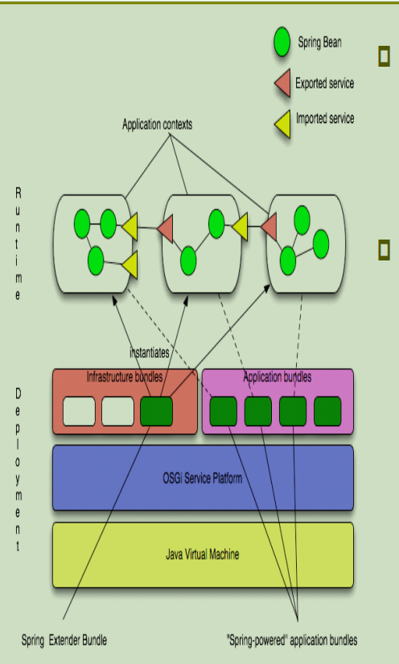
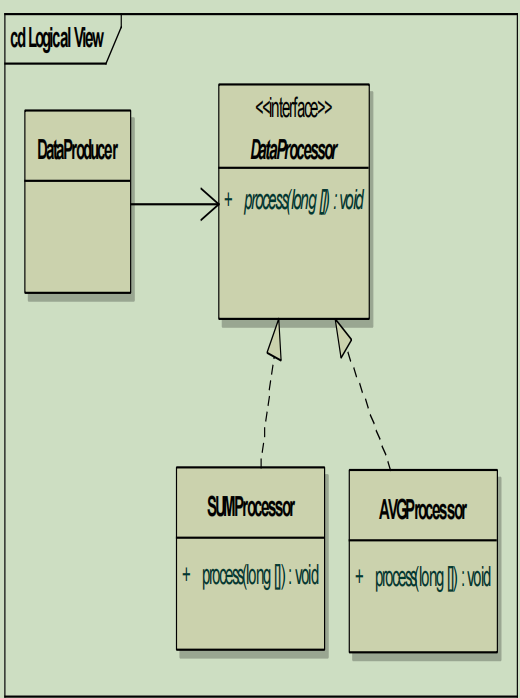

# Spring OSGI

## 1、Spring-DM

### （1）Spring-DM简介 

Srping和OSGI结合我们可以获得一下特性：

- 更好的**分离应用逻辑与模块**
- 同时部署一个模块**多个版本**的能力
- **动态查找、使用系统其他模块提供的服务的能力**
- 在运行时系统中**动态部署、升级、卸载模块**的能力
- 使用Spring框架在模块之间实**例化、配置，集成，装饰**组件
- 让企业应用开发者使用简单、熟悉的编程模型开发OSGI平台的功能

缺点：开发及调试困难

### （2）Spring-OSGI简介

- 每个Bundle中都有一个application-context
- Spring Bean实现的服务可以导出为OSGI服务
  - instantitates：实例化
  - infrashtucture bundles：基础设施包
  - application bundles：应用程序包
  - OSGI Service platform：OSGI服务平台
  - Spring Extender Bundle：Spring扩展包
  - Spring-Powered application bundles：spring驱动的应用程序包



## 2、系统运行要求

- JDK 1.4及以后版本
- OSGI R4标准（在bundle配置中需要注明“Bundle-ManfifestVersion:2”）
- 调试环境搭建
  - 以Equinox 3.2.2
  - 采用eclipse 3.2

## 3、Spring-DM Bundle

在META-INF路径下创建Spring目录，改路径下的xml文件会默认被装载（avgprocessor.xml）

```xml
<?xml version="1.0" encoding="UTF-8"?>
<beans 
xmlns="http://www.springframework.org/schema/beans"
xmlns:xsi="http://www.w3.org/2001/XMLSchema-instance"
xmlns:osgi="http://www.springframework.org/schema/osgi"
xsi:schemaLocation="
http://www.springframework.org/schema/beans
http://www.springframework.org/schema/beans/springbeans.xsd
http://www.springframework.org/schema/osgi
http://www.springframework.org/schema/osgi/springosgi.xsd">
<bean id="avgProcessor" scope="bundle" 
class="org.ccsoft.processor.impl.AVGProcessor"/>
<osgi:service ref="avgProcessor" 
interface="org.ccsoft.processor.DataProcessor"/>
</beans>
```

## 4、导出OSGI服务

- 可以将普通的spring bean导出为OSGI服务

- 同时注意在MANIFEST.MF中通过Export-Package导出相应的包

```xml
<bean id=“sumProcessor”class=“org.ccsoft.processor.impl.SUMProcessor"/>
<osgi:service ref="sumProcessor" interface="org.ccsoft.processor.DataProcessor"/>
```

- Scope设置成Bundle，表示将为每一个服务的导入者生产一个新的服务实例
- 当服务倒入者停止时，为它生产的服务实例也会被回收
- 这样你不必像以前一样实现org.osgi.framework.ServiceFactory

```xml
<osgi:service ref="mockModule" auto-export="interfaces">
<osgi:service-properties>
<entry key="flag" value="test"/>
<entry key="flag1" value="test1"/>
</osgi:service-properties>
</osgi:service>
```

serviece-properties:为导出的服务添加属性值，引入服务时可以通过这些值来过滤和筛选服务。

## 5、引用OSGI服务

```xml
<bean id=“dataProducer" class=" org.ccsoft.DataProducer ">
<property name=“dataProcessor" ref=" dataProcessors"/> 
</bean>

<osgi:reference id=“dataProcessor" interface=" org.ccsoft.processor.DataProcessor "/>
```

同时注意在MANIFEST.MF中通过import-package引入相应的包

```xml
<osgi:reference id=“dataProcessor" interface=" org.ccsoft.processor.DataProcessor " filter="(flag=test)"/>
```

Filter属性，可以通过service-properties进行筛选

有时候我们需要获得多个或所有提供指定服务类型的服务提供者

```xml
<osgi:list id=" dataProcessors" interface=" org.ccsoft.processor.DataProcessor "/> 
<osgi:set id=" dataProcessors " interface=" org.ccsoft.processor.DataProcessor “/>
```

List和Set区别在于如果又相同的服务实现（通过实现的equals比较是否相同）注册，在Set中仅会保留一个

同时注意服务集合会随着相应服务提供者的状态变化而发生变化，最好通过Iterator来访问集合。

## 6、编写动态特性的程序

- 基于OSGI开发的程序，应该尽量保持OSGI的动态特性
  - 程序不要依赖bundle的启动顺序
  - 程序应该可以根据注册服务的变化动态调整运行状态，以实现部分功能的即插即用。

- 监听服务的注册与注销

```xml
<osgi:reference id="someService" interface="com.xyz.MessageService"> 
<osgi:listener bind-method="onBind" unbindmethod="onUnbind“ref=“dataProducer”/>
</osgi:reference>
```

```java
public class DataProducer{
private Set processors
…
public void onBind(DataProcessor processor, Map properties){
    processors.add(processor);
}
public void onUnbind(DataProcessor processor, Map properties){
	processors.remove(processor);
} … }
```

示例：



- 数据生产者（DataProducer）调用不同的数据处理服务者（DataProcessor的实现）进行产生的数据处理

## 7、Log4j配置

配置可以放在另一个Fragment Bundle中

```
Fragment-Host:org.springframework.osgi.log4j.osgi
```

## 8、资源

- www.springframework.org/osgi
- www.osgi.org
- http://www.riawork.org
- http://dev2dev.bea.com.cn/blog/chaocai/
- http://www.blogjava.net/chaocai