# 设计模式

设计模式的目的：

- 代码重用性（相同功能的代码，不用多次编写）
- 可读性（编码规范性）
- 可扩展性（增加新功能，非常方便）
- 可靠性（增加新功能，对原来的功能没有影响）
- **高内聚，低耦合**

## 1、设计模式的原则

设计模式原则：

- 单一职责原则
- 接口隔离原则
- 依赖倒转原则
- 里氏替换原则
- 开闭原则
- 迪米特法则
- **合成复用原则**

### 1.1 单一职责原则 

 对类来说，即一个类应该只负责一项职责，如类A负责两个不同的职责：职责1，职责2。当职责1需求改变A时，可能造成职责2的执行错误，所以需要将类A的粒度分解为A1,A2。

- 降低类的复杂度，一个类只负责一个职责
- 提高类的可读性，可维护性
- 降低变更引起的风险
-  通常情况下，应当遵守单一职责原则

### 1.2 接口隔离原则

客户端不应该依赖它不需要的接口，即一个类对另一个类的依赖应该在建立在最小的接口上。

### 1.3 依赖倒转原则

- 高层模块不应该依赖低层模块，二者都应该依赖其抽象
- 抽象不应该依赖细节，细节应该依赖抽象
- 依赖倒转的中心思想是面向接口编程
- 依赖倒转原则是基于这样的设计理念：相对于细节的多变性，抽象的东西要稳定的多。以抽象为基础搭建的架构比以细节搭建的架构要稳定的多。在java中，抽象指的是接口或抽象类，细节就是具体的实现类。       
- 使用接口或抽象类的目的是制定好规范，而不涉及任何具体的操作，把展现i细节的任务交给他们的实现类去完成。

### 1.4 里氏替换原则

如果对每个类型为T1的对象O1,都有类型为T2的对象O2，使得以T1定义的所有程序p在所有的对象O1都代换成O2时，程序p的行为没有发生变化，那么类型T2是类型T1的子类型。换句话说，所有引用基类的地方必须能透明的使用其子类的对象。

在使用继承时，遵循里氏替换原则，在子类尽量不要重新父类的方法。

里氏替换原则告诉我们，继承实际上让两个类的耦合性增强了，在适当的情况下，可以通过聚合，组合，依赖来解决问题。 

### 1.5 开闭原则

- 开闭原则是编程是最基础、最重要的设计原则
- 一个软件实体如类，模块和函数应该对扩展开放（对提供方），对修改关闭（对使用方）。用抽象构建框架，对实现扩展细节。
- 当软件需要变化时，尽量通过扩展软件实体的行为来实现变化，而不是通过修改已有的代码来实现变化。
- 编程过程中遵循其他原则，使用设计模式的目的就是遵循开闭原则。

### 1.6 迪米特法则

- 一个对象应该对其他的对象保持最少的了解
- 类与类的关系越密切，耦合度越大
- 迪米特法则又叫最小知道原则，即一个类对自己依赖的类知道的越少越好。也就是说，对于被依赖的类不管多复杂，都尽量将逻辑封装在类的内部。对外除了提供public方法，不对外泄露任何信息。
- 迪米特法则还有个更简单的定义：只与直接的朋友通信。
- 直接的朋友：每个对象都会与其他对象有耦合关系，只要两个对象之间有耦合关系，我们就说这两个对象之间是朋友关系。耦合的方式有很多种，依赖，关联，组合，聚合等。其中我们称出现成员变量，方法参数，方法返回值的类为直接的朋友，而出现在局部变量中的类部署直接的朋友。也就是说，陌生的类最好不要以局部变量的形式出现在类的内部。

### 1.7 合成复用原则

原则是尽量使用合成/聚合的方式，而不是使用继承。 

## 设计模式了类型：

- 创建型模式：***单例模式***、抽象工厂模式、原型模式、建造者模式、***工厂模式***
- 结构型模式：适配器模式、桥接模式、***装饰模式***、组合模式、外观模式、享元模式、***代理模式***
- 行为型模式：模板方法模式、命令模式、访问者模式、迭代器模式、***观察者模式***、中介者模式、备忘录模式、解释器模式（Interpreter模式）、状态模式、策略模式、职责链模式（责任链模式）


## 2、单例模式

所谓类的单例设计模式，就说采用一定的方法保证在整个的软甲系统中，对某个类只能存在一个对象实例，并且改类只提供一个取得其对象实例的方法。

比如Hibernate的SessionFactory，它充当数据存储源的代理，并负责创建Session对象。SessionFactory并不是轻量级的，一般情况下一个项目通常只需要一个SessionFactory就够，这时就会用到单例模式。

### 2.1 饿汉式（静态变量）

只要类加载，对象就会创建，无论该对象会不会被使用，对象都会被创建，对象通常是重量级的对象，可能会没有使用，造成资源浪费

```java
public class SingleTon01 {
    public static void main(String[] args) {
        GirlFriend instance = GirlFriend.getInstance();
        System.out.println(instance);
    }
}

class GirlFriend{
    private String name;
    // 1.构造器私有化
    private GirlFriend(String name) {
        this.name = name;
    }

    // 2. 在类的内部直接创建  为了能在静态方法中返回gf对象，需要修饰static
    private static GirlFriend gf = new GirlFriend("xiaohong ");

    // 3.提供一个公共的static方法，返回gf对象
    public static GirlFriend getInstance(){
        return gf;
    }

    @Override
    public String toString() {
        return "GirlFriend{" +
                "name='" + name + '\'' +
                '}';
    }
}
```

### 2.2 懒汉式（静态代码块）

```java
class SingleTon {
    // 1.构造器私有化，外部不能new

    private SingleTon() {
    }
    // 2.本类内部创建对象实例
    private static SingleTon instance;

    // 在静态代码块中创建单例对象
    static{
        instance = new SingleTon();
    }

    // 3. 提供共有静态方法，返回实例对象
    public static SingleTon getInstance(){
        return instance;
    }

}
```

优点：

- 写法简单，类加载就实例化，避免线程同步问题

缺点：

- 类加载就完成实例化，没有达到Lazy Loading的效果。如果从始至终都没有使用过这个实例，则会造成内存的浪费。

### 2.3 懒汉式（线程不安全）

懒汉式只有当用户使用getInstance时，才会返回cat对象，当再次调用的时候，会返回上次创建的cat对象。

```java
public class SingleTon02 {
    public static void main(String[] args) {
        Cat instance = Cat.getInstance();
        System.out.println(instance);
    }
}

class Cat{
    private String name;

    // 1.构造器私有化
    private Cat(String name) {
        this.name = name;
    }

    // 2.定义一个静态属性
    private static Cat cat;

    // 3.提供公共的public的static方法，返回一个cat对象
    public static Cat getInstance(){
        if (cat ==  null){
            cat = new Cat("xiaohong");
        }
        return cat;
    }

    @Override
    public String toString() {
        return "Cat{" +
                "name='" + name + '\'' +
                '}';
    }
}
```

优缺点：

- 起到了懒加载的效果，但是只能在单线程使用
- 如果在多线程下，一个线程进入if（cat == null）判断语句款，还未来得及往下执行，另一个线程也通过了这个判断语句，这时回产生多个实例，所以多线程下不可以使用这种方式。

### 2.4 懒汉式（线程安全，同步方法）

```java
public class SingleTon02 {
    public static void main(String[] args) {
        Cat instance = Cat.getInstance();
        System.out.println(instance);
    }
}

class Cat{
    private String name;

    // 1.构造器私有化
    private Cat(String name) {
        this.name = name;
    }

    // 2.定义一个静态属性
    private static Cat cat;

    // 3.提供公共的public的static方法，加入了同步处理的代码，解决了线程安全问题
    public static synchronized Cat getInstance(){
        if (cat ==  null){
            cat = new Cat("xiaohong");
        }
        return cat;
    }

    @Override
    public String toString() {
        return "Cat{" +
                "name='" + name + '\'' +
                '}';
    }
}
```

- 解决了线程不安全问题
- 效率太低了，每个线程在想获得类的实例的时候，执行了getInstance方法都要进行同步。其实这个方法只执行一次实例化代码就够了，后面想获得该类实例，直接return就行了。方法同步效率太低。
- 实际开发过程中，不推荐使用这种方法。

### 2.5 懒汉式（线程安全（想），同步代码块）

- 不能起到线程同步的作用，同时线程不安全了
- 实际开发过程中，不能使用这种方式

### 2.6 双重检查

```java
public class SingleTonTest {
    public static void main(String[] args) {
        SingleTon04 instance = SingleTon04.getInstance();
        System.out.println(instance);
    }
}
class SingleTon04{
    private static volatile SingleTon04 instance;

    public SingleTon04() {
    }

    // 提供一个静态的公有方法，加入双重检查代码，解决线程安全问题，同时解决懒加载问题
    public static synchronized SingleTon04 getInstance(){
        if (instance == null){
            synchronized (SingleTon04.class){
                if (instance == null){
                    instance = new SingleTon04();
                }
            }
        }
        return instance;
    }
}
```

优缺点：

- 双重检查概念是多线程开发中经常使用到的，如代码所示，我们进行了两次if （singleTon == null）检查，这样可以保证线程安全
- 实例化代码只会执行一次，后面再次访问时，判断if（singleTon == null）直接return实例化对象，避免反复进行方法同步。
- 线程安全；延迟加载；效率较高
- 实际开发中，推荐使用这种单例设计模式

### 2.7 静态内部类

静态内部类的特点：

- 外部类装载的时候，内部类不会立即被装载

- 静态内部类调用方法，内部类装载，且只会加载一次，且线程是安全的

```java
public class SingletonTest02 {
    public static void main(String[] args) {
        SingleTon05 instance = SingleTon05.getInstance();
        System.out.println(instance);
    }
}

class SingleTon05 {
    public SingleTon05() {
    }
    // 静态内部类，该类有一个静态属性SingleTon05
     private static class SingleTonInstance{
        private static final SingleTon05 INSTANCE = new SingleTon05();
    }

    public static SingleTon05 getInstance(){
        return SingleTonInstance.INSTANCE;
    }
}
```

-  这种方法采用类加载机制保证初始化实例时只有一个线程。
- 静态内部类方式在Singleton05类被装载时并不会立即实例化，而是在需要的时候调用getInstance方法，才会装载SingletonInstance类，从而完成Singleton05的实例化
- 类的静态属性只会在第一次加载类的时候初始化，JVM帮我们保证了线程的安全性，类进行初始化的时候，别的线程是无法进入的。
- 避免了线程不安全，利用静态内部类的特点延迟加载，效率高
- 推荐使用

### 2.8 枚举

```java
public class SingleTonTest03 {
    public static void main(String[] args) {
        Singleton instance = Singleton.INSTANCE;
        Singleton instance2 = Singleton.INSTANCE;
        System.out.println(instance == instance2);
        System.out.println(instance.hashCode());
        System.out.println(instance2.hashCode());
    }
}

enum Singleton{
    INSTANCE;
    public void sayOK(){
        System.out.println("pk~");
    }
}
```

- 推荐使用

单例模式注意事项和细节说明：

- 单例模式保证了系统内存中该类只存在一个对象，节省了系统资源，对于一些需要频繁销毁的对象，使用单例模式可以提高系统性能
- 当想实例化一个单例类的时候，必须记住使用相应的获取对象的方法，而不是直接new
- 单例模式使用场景：
  - 频繁进行创建和销毁的对象
  - 创建对象时耗时过多或耗费资源过多（重量级对象），
  - 但又经常使用到的对象，工具类对象、频繁访问数据库或文件的对象（比如数据源，session工厂）

## 3、工厂模式

### 3.1 简单工厂模式

- 简单工厂模式属于创建型模式，是工厂模式的一种。**简单工厂模式由一个工厂对象决定创建哪一种产品类的实例**。简单工厂模式是工厂模式家族最简单使用的模式
- 简单工厂模式：定义一个创建对象的类，由这个类来封装实例化对象的行为（代码）
- 在软件开发中，当我们会用到大量的创建某种、某类或某批对象时，就会使用到工厂模式。

Pizza:

```java
package simplefactory;

public abstract class Pizza {
    protected String name;

    public String getName() {
        return name;
    }

    public void setName(String name) {
        this.name = name;
    }
    public abstract void prepare();
    public void bake(){
        System.out.println(name + "baking");
    }
    public void cut(){
        System.out.println(name + "cutting");
    }
    public void box(){
        System.out.println(name + "boxing");
    }
}
```

Greek:

```java
package simplefactory;

public class Greek extends Pizza{

    @Override
    public void prepare() {
        System.out.println("给希腊披萨准备原材料");
    }
}
```

Cheese:

```java
package simplefactory;

public class Cheese extends Pizza{
    @Override
    public void prepare() {
        System.out.println("给奶酪披萨准备原材料");
    }
}
```

Pepper:

```java
package simplefactory;

public class Pepper extends Pizza{
    @Override
    public void prepare() {
        System.out.println("给花椒披萨准备原材料");
    }
}
```

SimpleFactory:

```java
package simplefactory;

// 简单工厂
public class SimpleFactory {
    // 根据orderType返回对应的pizza对象
    public Pizza createPizza(String orderType){
        Pizza pizza = null;
        System.out.println("使用简单工厂模式");
        if (orderType.equals("greek")){
            pizza = new Greek();
            pizza.setName("希腊披萨");
        }else if(orderType.equals("cheese")){
            pizza = new Cheese();
            pizza.setName("奶酪披萨");
        }else if(orderType.equals(("pepper"))){
            pizza = new Pepper();
            pizza.setName("胡椒披萨");
        }
        return pizza;
    }

    // 简单工厂模式 也叫静态工厂模式
    public static Pizza createPizza2(String orderType){
        Pizza pizza = null;
        System.out.println("使用简单工厂模式");
        if (orderType.equals("greek")){
            pizza = new Greek();
            pizza.setName("希腊披萨");
        }else if(orderType.equals("cheese")){
            pizza = new Cheese();
            pizza.setName("奶酪披萨");
        }else if(orderType.equals(("pepper"))){
            pizza = new Pepper();
            pizza.setName("胡椒披萨");
        }
        return pizza;
    }
}
```

OrderPizza:

```java
package simplefactory;

import java.io.BufferedReader;
import java.io.IOException;
import java.io.InputStreamReader;

public class OrderPizza {
    // 定义一个简单工厂对象
    SimpleFactory simpleFactory;
    Pizza pizza = null;

    public OrderPizza(SimpleFactory simpleFactory) {
        setFactory(simpleFactory);
    }

    public void setFactory(SimpleFactory simpleFactory){
        String orderType = ""; // 用户输入
         this.simpleFactory = simpleFactory; // 设置简单工厂对象
        do {
            orderType = getType();
            pizza = this.simpleFactory.createPizza(orderType);
            // 输出pizza
            if (pizza != null){
                pizza.prepare();
                pizza.bake();
                pizza.cut();
                pizza.box();
            }else {
                System.out.println("订购披萨失败");
            }
        }while (true);
    }
    private String getType(){
        try {
            BufferedReader reader = new BufferedReader(new InputStreamReader(System.in));
            System.out.println("input pizza:");
            String s = reader.readLine();
            return s;
        } catch (IOException e) {
            e.printStackTrace();
            return "";
        }
    }
}
```

OrderPizza2:

```java
package simplefactory;

import java.io.BufferedReader;
import java.io.IOException;
import java.io.InputStreamReader;

public class OrderPizza2 {
    // 定义一个简单工厂对象
    Pizza pizza = null;
    String orderType = "";


    public OrderPizza2() {
        do {
            orderType = getType();
            pizza = SimpleFactory.createPizza2(orderType);
            // 输出pizza
            if (pizza != null){
                pizza.prepare();
                pizza.bake();
                pizza.cut();
                pizza.box();
            }else {
                System.out.println("订购披萨失败");
            }
        }while (true);
    }


    private String getType(){
        try {
            BufferedReader reader = new BufferedReader(new InputStreamReader(System.in));
            System.out.println("input pizza:");
            String s = reader.readLine();
            return s;
        } catch (IOException e) {
            e.printStackTrace();
            return "";
        }
    }
}
```

PizzaStore:

```java
package simplefactory;

public class PizzaStore {
    public static void main(String[] args) {
        // 使用简单工厂模式
//        new OrderPizza(new SimpleFactory());
//        System.out.println("退出");
        new OrderPizza2();
    }
}
```

### 3.2 工厂方法模式

**工厂方法模式设计方案**：将披萨项目中的实例化功能抽象成抽象方法，在不同的口味点餐子类中具体实现。

**工厂方法模式**：定义了一个创建对象的抽象方法，由子类决定要实例化的类。工厂方法模式将对象的实例化推延到子类。

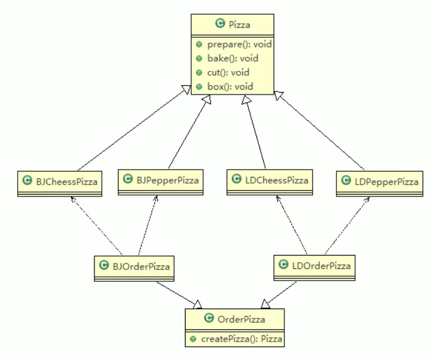

BJCheese:

```java
package factorymethod;

public class BJCheese extends Pizza{

    @Override
    public void prepare() {
        setName("北京的奶酪pizza");
        System.out.println("给北京的奶酪pizza准备原材料");
    }
}
```

BJPepper:

```java
package factorymethod;

public class BJPepper extends Pizza{
    @Override
    public void prepare() {
        setName("北京的胡椒pizza");
        System.out.println("给北京的胡椒pizza准备原材料");
    }
}
```

LDCheese:

```java
package factorymethod;

public class LDCheese extends Pizza{

    @Override
    public void prepare() {
        setName("伦敦的奶酪pizza");
        System.out.println("给伦敦的奶酪pizza准备原材料");
    }
}
```

LDPepper:

```java
package factorymethod;

public class LDPepper extends Pizza{

    @Override
    public void prepare() {
        setName("伦敦的胡椒pizza");
        System.out.println("给伦敦的胡椒pizza准备原材料");
    }
}
```

OrderPizza:

```java
package factorymethod;

import java.io.BufferedReader;
import java.io.IOException;
import java.io.InputStreamReader;

public abstract class OrderPizza {

    // 定义一个抽象方法，creatPizza，让各个工厂子类自己实现
    abstract Pizza creatPizza(String orderType);

    // 构造器
    public OrderPizza() {
        Pizza pizza = null;
        String orderType = "";
        do {
            orderType = getType();
            // 抽象方法，由工厂子类实现
            pizza = creatPizza(orderType);
            // 输出pizza,制作过程
            if (pizza != null) {
                pizza.prepare();
                pizza.bake();
                pizza.cut();
                pizza.box();
            }else{
                System.out.println("输入的pizza口味目前本商店没有，正在加紧准备。。。");
            }
        } while (true);
    }

    private String getType() {
        try {
            BufferedReader reader = new BufferedReader(new InputStreamReader(System.in));
            System.out.println("input pizza:");
            String s = reader.readLine();
            return s;
        } catch (IOException e) {
            e.printStackTrace();
            return "";
        }
    }
}
```

LDOrderPizza:

```java
package factorymethod;

public class LDOrderPizza extends OrderPizza{

    @Override
    Pizza creatPizza(String orderType) {
        Pizza pizza = null;
        if (orderType.equals("cheese")){
            pizza = new LDCheese();
        }else if (orderType.equals("pepper")){
            pizza = new LDPepper();
        }
        return pizza;
    }
}
```

BJOrderPizza:

```java
package factorymethod;

public class BJOrderPizza extends OrderPizza{

    @Override
    Pizza creatPizza(String orderType) {
        Pizza pizza = null;
        if (orderType.equals("cheese")){
            pizza = new BJCheese();
        }else if (orderType.equals("pepper")){
            pizza = new BJPepper();
        }
        return pizza;
    }
}
```

PizzaStore:

```java
package factorymethod;

public class PizzaStore {
    public static void main(String[] args) {
        // 创建北京口味的各种pizza
        new BJOrderPizza();
    }
}
```

### 3.3  抽象工厂模式

 基本介绍：

- 抽象工厂模式：定义了一个接口用于创建相关或有依赖关系的对象簇，而无需指明具体的类
- 抽象工厂模式可以将简单工厂模式和工厂方法模式进行整合
- 从设计层面来看，抽象工厂模式就是对简单工厂模式的改进（进一步抽象）。
- 将工厂抽象成两层，AbsFactory（抽象工厂）和具体实现的工厂子类。程序员可以根据创建对象类型使用对应的工厂子类。这样将单个简单工厂变成工厂簇，更利于代码的维护和发展。

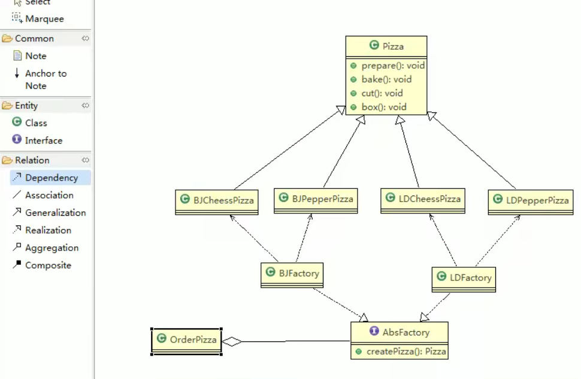


工厂模式小结：

- 工厂模式的意义：将实例化的对象提取出来，放到一个类中统一管理和维护，达到和主项目的依赖关系的解耦，从而提高项目的扩展性和可维护性。
- 三种工厂模式：简单工厂模式，工厂方法模式，抽象工厂模式
- 设计模式的依赖抽象原则：
  - 创建实例对象，不要直接new类，而是把这个new类的动作放到一个工厂的方法中，并返回。有的书上还说，变量不要直接持有具体类的引用。
  - 不要让类继承具体类，而是继承抽象类或者实现接口。
  - 不要覆盖基类中已经实现的方法。

## 4、原型模式

原型模式基本介绍

- 原型模式（Prototype）是指：用原型实例指定创建对象的种类，并且通过拷贝这些原型，创建新的对象。
- 原型模式是一种创建型设计模式，允许一个对象再创建另外一个可定制的对象，无需知道如创建的细节。
- 工作原理：通过将一个原型对象传给那个要发动创建的对象，这个要发动创建的对象通过请求原型对象拷贝他们来实施创建，即对象.clone()
- 形象的理解：孙悟空拔出猴毛，变出其他孙悟空 

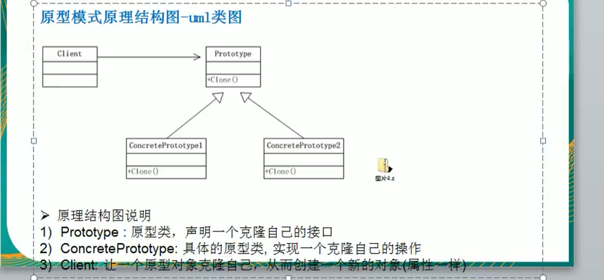

Sheep:

```JAVA
package prototype.improve;

public class Sheep implements Cloneable {
    private String name;
    private int age;
    private  String color;

    @Override
    public String toString() {
        return "Sheep{" +
                "name='" + name + '\'' +
                ", age=" + age +
                ", color='" + color + '\'' +
                '}';
    }

    public String getName() {
        return name;
    }

    public void setName(String name) {
        this.name = name;
    }

    public int getAge() {
        return age;
    }

    public void setAge(int age) {
        this.age = age;
    }

    public String getColor() {
        return color;
    }

    public void setColor(String color) {
        this.color = color;
    }

    public Sheep(String name, int age, String color) {
        this.name = name;
        this.age = age;
        this.color = color;
    }

    // 克隆该实例，使用默认的clone方法来完成
    @Override
    protected Object clone() throws CloneNotSupportedException {
        Sheep sheep = null;
        try {
            sheep = (Sheep) super.clone();
        } catch (CloneNotSupportedException e) {
            e.printStackTrace();
            System.out.println(e.getMessage());
        }
        return sheep ;
    }
}
```

Client：

```java
package prototype.improve;

public class Client {
    public static void main(String[] args) throws CloneNotSupportedException {
        Sheep sheep = new Sheep("tom", 10, "white");
        Sheep clone1 = (Sheep) sheep.clone();
        Sheep clone2 = (Sheep) sheep.clone();
        Sheep clone3 = (Sheep) sheep.clone();
        Sheep clone4 = (Sheep) sheep.clone();
        System.out.println(clone1);
        System.out.println(clone2);
        System.out.println(clone3);
        System.out.println(clone4);
    }
}
```

**浅拷贝：**

- 对于数据类型是基本数据类型的成员变量，浅拷贝会直接进行值传递，也就是将该属性复制一份给新的对象。

- 对于数据类型是引用类型的成员变量，比如说成员变量是某个数组、某个类的对象等，那么浅拷贝会进行引用传递，也就是将该成员变量的引用值（内存地址）复制一份给新的对象。因为实际上两个对象的该成员变量都指向同一个实例。在这种情况下，在一个对象中修改成员变量会影响到另一个对象的该成员变量值。

- 克隆羊就是浅拷贝

- 浅拷贝是使用默认的clone()方法来实现

  sheep = (Sheep)super.clone()；

**深拷贝：**

- 复制对象的所有基本数据类型的成员变量值
- 为所有引用类型的成员变量申请存储空间，并复制每个引用数据类型成员变量所引用的对象，直到该对象可达的所有对象，也就是说，对象进行深拷贝要对整个对象进行拷贝
- 深拷贝的实现方式
  - 重新clone方法
  - 对象序列化

DeepCloneableTarget：

```java
package prototype.deepclone;

import java.io.Serializable;

public class DeepCloneableTarget implements Serializable, Cloneable {

    private static final long serialVersionUID = 1;

    private String cloneName;

    private String cloneClass;

    public DeepCloneableTarget(String cloneName, String cloneClass) {
        this.cloneName = cloneName;
        this.cloneClass = cloneClass;
    }

    // 该类的属性都是String，因此我们这里使用默认的clone方法即可
    @Override
    protected Object clone() throws CloneNotSupportedException {
        return super.clone();
    }
}
```

DeepPrototype:

```java
package prototype.deepclone;

import java.io.*;

public class DeepPrototype implements Cloneable, Serializable {
    public String name;
    public DeepCloneableTarget deepCloneableTarget;

    public DeepPrototype(String name, DeepCloneableTarget deepCloneableTarget) {
        this.name = name;
        this.deepCloneableTarget = deepCloneableTarget;
    }

    public DeepPrototype() {
    }

    // 深拷贝 -重写clone
    @Override
    protected Object clone() throws CloneNotSupportedException {
        Object deep = null;
        // 对基本数据类型和string的克隆
        deep = super.clone();
        // 对引用类型的属性单独克隆
        DeepPrototype deepPrototype = (DeepPrototype) deep;
        deepPrototype.deepCloneableTarget = (DeepCloneableTarget) deepCloneableTarget.clone();
        return deepPrototype;
    }

    //  序列化
    public Object deepClone() {
        // 创建流对象
        ByteArrayOutputStream bos = null;
        ObjectOutputStream oos = null;
        ByteArrayInputStream bis = null;
        ObjectInputStream ois = null;
        try {
            // 序列化对象
            bos = new ByteArrayOutputStream();
            oos = new ObjectOutputStream(bos);
            // 当前这个对象以对象流的方式输出
            oos.writeObject(this);

            // 反序列化
            bis = new ByteArrayInputStream(bos.toByteArray());
            ois = new ObjectInputStream(bis);
            DeepPrototype copyObj = (DeepPrototype) ois.readObject();

            return copyObj;
        } catch (Exception e) {
            e.printStackTrace();
            return null;
        } finally {
            try {
                bos.close();
                oos.close();
                bis.close();
                ois.close();
            } catch (IOException e) {
                e.printStackTrace();
                System.out.println(e.getMessage());
            }

        }

    }
}
```

```java
package prototype.deepclone;

public class Client {
    public static void main(String[] args) throws CloneNotSupportedException {
        DeepPrototype deepPrototype = new DeepPrototype();
        deepPrototype.name = "songjiang";
        deepPrototype.deepCloneableTarget = new DeepCloneableTarget("daniu", "danniu ' class");
        // 方式一
/*        DeepPrototype clone = (DeepPrototype) deepPrototype.clone();
        System.out.println(deepPrototype.hashCode());
        System.out.println(clone.hashCode());*/

        // 方式二
        DeepPrototype clone = (DeepPrototype) deepPrototype.deepClone();
        System.out.println(clone.name);
        System.out.println(deepPrototype.hashCode());
        System.out.println(clone.hashCode());
    }
}
```

原型模式的注意事项和细节：

- 创建新的对象比较复杂时，可以利用原型模式简化对象的创建过程，同时也能够提高效率
- 不用重新初始化对象，而是动态的获得对象运行时的状态
- 如果原型对象发生变化，其他克隆对象也会发生相应的变化，无需修改代码
- 再实现深克隆的时候可能需要比较复杂的代码
- 缺点：
  - 需要为每一个类配备一个克隆方法，这对全新的类来说比较困那，但对已有的类进行改造时，需要修改其源代码，违背了ocp原则。

## 5、装饰者模式

定义：

- 装饰者模式：动态的将新功能附加到对象上，再对象功能扩展方面，它比继承更有弹性，装饰者模式也体现了开闭原则（ocp）。
- 动态的将新功能附加到对象和ocp原则，在后面的应用实例会以代码的形式体现。

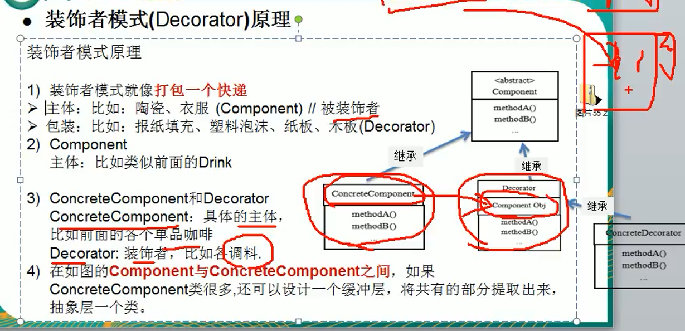

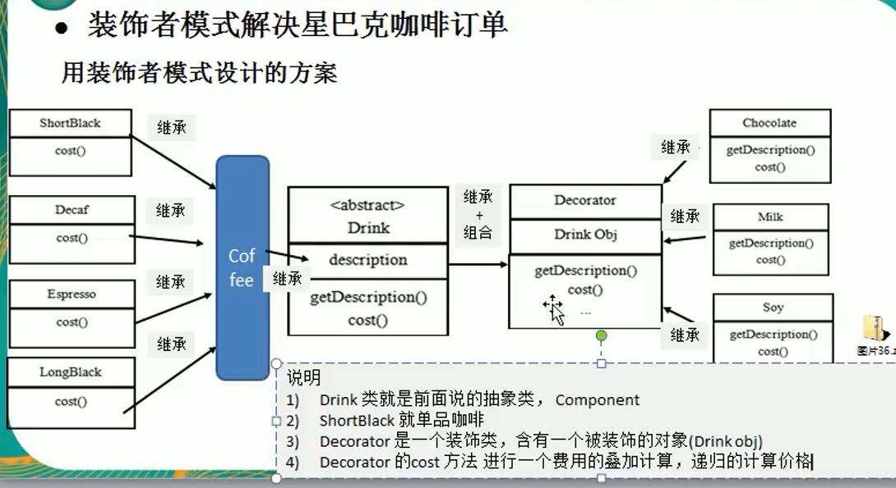

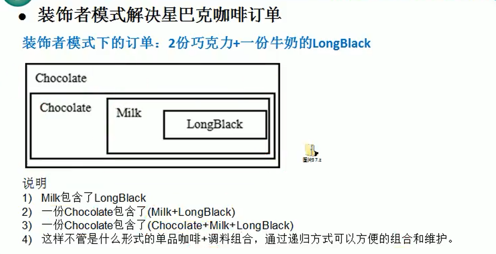

Drink：

```java
package decorator;

public abstract class Drink {
    public String desc;
    private float price = 0.0f;

    public String getDesc() {
        return desc;
    }

    public void setDesc(String desc) {
        this.desc = desc;
    }

    public float getPrice() {
        return price;
    }

    public void setPrice(float price) {
        this.price = price;
    }

    public abstract float cost();
}
```

Coffee：

```java
package decorator;

public class Coffee extends Drink{
    @Override
    public float cost() {
        return super.getPrice();
    }
}
```

Esprsso：

```java
package decorator;

public class Espresso extends Coffee {
    public Espresso() {
        setDesc("意大利coffee");
        setPrice(6.0f);
    }
}
```

LongBlack:

```java
package decorator;

public class LongBlack extends Coffee{
    public LongBlack() {
        setDesc("longblack");
        setPrice(5.0f);
    }
}
```

Decorator:

```java
package decorator;

public class Decorator extends Drink {

    private Drink obj;

    public Decorator(Drink obj) { // 组合
        this.obj = obj;
    }

    @Override
    public float cost() {
        // getPrice 自己价格
        return super.getPrice() + obj.cost();
    }

    @Override
    public String getDesc() {
        return super.desc + " " + super.getPrice() + "&&" + obj.getDesc();
    }
}
```

Chocolate

```java
package decorator;

public class Chocolate extends Decorator{

    public Chocolate(Drink obj) {
        super(obj);
        setDesc("巧克力");
        // 调味品的价格
        setPrice(3.0f);
    }

}
```

Milk:

```java
package decorator;

public class Milk extends Decorator{

    public Milk(Drink obj) {
        super(obj);
      setDesc("牛奶");
      setPrice(2.0f);
    }
}
```

```java
package decorator;

public class CoffeeBar {
    public static void main(String[] args) {
        // 1.点一份longblack
        Drink order = new LongBlack();
        System.out.println( "费用一" + order.cost());
        System.out.println("描述信息：：" + order.getDesc());
        // 2. 加入一份牛奶
        order = new Milk(order);
        System.out.println( "费用二" + order.cost());
        System.out.println("描述信息：：" + order.getDesc());
        // 3. 加入一份巧克力
        order = new Chocolate(order);
        System.out.println( "费用三" + order.cost());
        System.out.println("描述信息：：" + order.getDesc());
        // 4. 加入一份巧克力
        order = new Chocolate(order);
        System.out.println( "费用四" + order.cost());
        System.out.println("描述信息：：" + order.getDesc());
    }
}
```

## 6、代理模式（Proxy）

代理模式基本介绍：

- 代理模式：为一个对象提供一个替身，以控制这个对象的访问。即通过代理对象访问目标对象，这样做的好处是：可以在目标对象实现的基础上，增强额外的功能操作，即扩展目标对象的功能。
- 被代理的对象可以是远程对象、创建开销大的对象或需要完全控制的对象
- 代理模式又三种不同的形式
  - 静态代理
  - 动态代理(JDK代理)
  - cglib代理(可以在内存动态的创建对象，而不需要实现接口)

### 6.1 静态代理

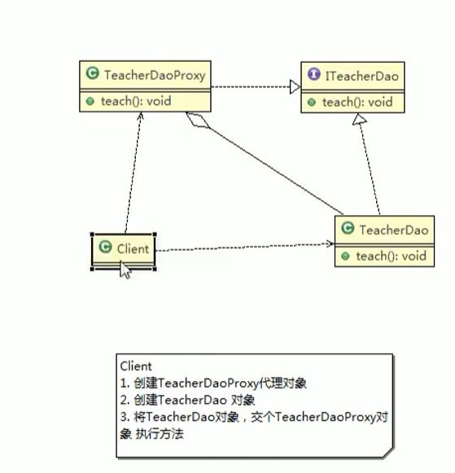

ITeacherDao:

```java
package proxy.staticproxy;

public interface ITeacherDao {
    void teach();
}
```

ITeacherDao

```java
package proxy.staticproxy;

public class TeacherDao implements ITeacherDao{
    @Override
    public void teach() {
        System.out.println("老师正在授课");
    }
}
```

ITeacherDaoProxy:

```java
package proxy.staticproxy;

public class TeacherDaoProxy implements ITeacherDao{
    // 目标对象，通过接口聚合
    private ITeacherDao target;

    public TeacherDaoProxy(ITeacherDao target) {
        this.target = target;
    }

    @Override
    public void teach() {
        System.out.println("start。。。");
        target.teach();
        System.out.println("end。。。");
    }
}
```

Client:

```java
package proxy.staticproxy;

public class Client {
    public static void main(String[] args) {
        // 创建目标对象（被代理对象）
        TeacherDao teacherDao = new TeacherDao();
        // 创建代理对象,将被代理对象传给代理对象
        TeacherDaoProxy teacherDaoProxy = new TeacherDaoProxy(teacherDao);
        teacherDaoProxy.teach();
      }
}
```

优点：

- 在不修改目标对象的功能前提下，能够通过代理对象对目标功能扩展

缺点：

- 因为代理对象需要与目标对象实现一样的接口，所以会有很多代理类，代码翻倍

- 一旦接口增加方法，目标对象与代理对象都要维护

### 6.2 动态代理

动态代理基本介绍：

- 代理对象，不需要实现接口，但是目标对象要实现接口，否则不能动态代理
- 代理对象的生成，是利用JDK的api，动态在内存中构建代理对象
- 动态代理也叫做：JDK代理、接口代理

JDK生成代理对象的api

- 代理类所在的包：java.lang.reflect.Proxy
- JDK实现代理只需要使用newProxyInstance方法，但是该方法需要接收三个参数，完整的写法是：

```java
public static Object newProxyInstance(ClassLoader loader,
                                      Class<?>[] interfaces,
                                      InvocationHandler h)
```

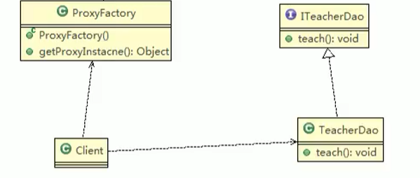

getProxyInstance():

1. 根据传入的对象（TeacherDao），目标对象
1. 利用反射机制，返回一个代理对象
1. 然后通过代理对象，调用目标对象方法

```java
package proxy.dynamic;

public interface ITeacherDao {
    void teach();
}
```

```java
package proxy.dynamic;


public class TeacherDao implements ITeacherDao {

    @Override
    public void teach() {
        System.out.println("老师正在授课......");
    }
}
```

```java
package proxy.dynamic;

import java.lang.reflect.InvocationHandler;
import java.lang.reflect.Method;
import java.lang.reflect.Proxy;

public class ProxyFactory {
    // 维护一个目标对象
    private Object target;

    // 构造器，对target进行初始化
    public ProxyFactory(Object target) {
        this.target = target;
    }

    // 给目标对象生成一个代理对象
    /*
    *     public static Object newProxyInstance(ClassLoader loader,
                                          Class<?>[] interfaces,
                                          InvocationHandler h)
    *    1. ClassLoader loader:指定当前目标对象使用的类加载器,获取类加载器的方法固定
    *    2. Class<?>[] interfaces:目标对象实现的接口类型，使用泛型确认类型
    *    3. InvocationHandler h：事情处理，执行目标对象的方法时，会触发事情处理器方法，会把
    *                           当前执行的目标对象方法作为参数处理传入
    * */
    public Object getProxyInstance() {
        return Proxy.newProxyInstance(target.getClass().getClassLoader(), target.getClass().getInterfaces(), new InvocationHandler() {
            @Override
            public Object invoke(Object proxy, Method method, Object[] args) throws Throwable {
                System.out.println("JDK代理开始");
                Object returnVal = method.invoke(target, args);
                return returnVal;
            }
        });
    }
}
```

```java
package proxy.dynamic;

public class Client {
    public static void main(String[] args) {
        // 创建一个目标对象
        ITeacherDao target = new TeacherDao();
        ITeacherDao proxyInstance = (ITeacherDao) new ProxyFactory(target).getProxyInstance();
        System.out.println(proxyInstance);
        System.out.println(proxyInstance.getClass());
    }
}
```

### 6.3 cglib代理

cglib代理模式基本介绍：

- 静态代理和jdk代理模式都要求目标对象是实现一个接口，但有时目标对象只是一个单独的对象，并没有实现任何接口，这个时候可使用目标对象子类来实现代理，这就说cglib代理
- cglib代理也叫做子类代理，他是在内存中创建一个子类对象从而实现对目标对象功能扩展，有些书也将cglib代理归属到动态代理
- cglib是一个强大的高性能的代码生成包，它可以在运行期扩展java类与实现java接口，它广泛的被许多AOP框架使用，例如SpringAOP ,实现方法拦截
- 在AOP编程中如何选择代理模式
  - 目标对象需要实现接口，使用jdk代理
  - 目标对象不需要实现接口，用cglib代理
- cglib包的底层是通过使用字节码处理框架ASM来转换字节码并生成新的类。

**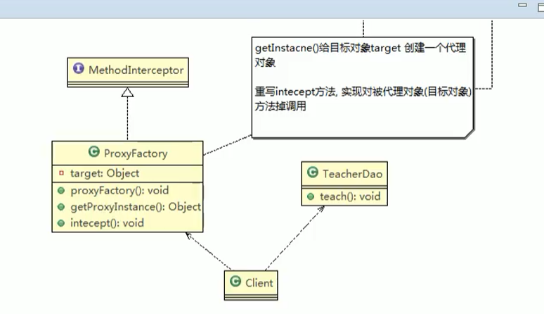**

```xml
<dependency>
  <groupId>cglib</groupId>
  <artifactId>cglib</artifactId>
  <version>3.2.4</version>
</dependency>
<dependency>
    <groupId>org.ow2.asm</groupId>
    <artifactId>asm-commons</artifactId>
    <version>9.2</version>
</dependency>
<dependency>
    <groupId>org.ow2.asm</groupId>
    <artifactId>asm-tree</artifactId>
    <version>9.2</version>
</dependency>
<dependency>
    <groupId>org.ow2.asm</groupId>
    <artifactId>asm</artifactId>
    <version>9.2</version>
</dependency>
```

```java
package proxy.cglib;

public class TeacherDao {
    public void teach(){
        System.out.println("老师正在授课");
    }
}
```

```java
package proxy.cglib;

import net.sf.cglib.proxy.Enhancer;
import net.sf.cglib.proxy.MethodInterceptor;
import net.sf.cglib.proxy.MethodProxy;

import java.lang.reflect.Method;

public class ProxyFactory implements MethodInterceptor {

    // 维护一个目标对象
    private Object  target;

    // 构造器，传入一个被代理的对象
    public ProxyFactory(Object target) {
        this.target = target;
    }

    // 返回一个代理对象
    public Object getProxyInstance(){
        // 1.创建一个工具类
        Enhancer enhancer = new Enhancer();
        // 2.设置父类
        enhancer.setSuperclass(target.getClass());
        // 3. 设置回调函数
        enhancer.setCallback(this);
        // 4. 创建子类对象，即代理对象
        return enhancer.create();
    }

    // 重新intercept方法，会调用目标对象的方法
    @Override
    public Object intercept(Object o, Method method, Object[] args, MethodProxy methodProxy) throws Throwable {
        System.out.println("cglib代理模式...start");
        Object returnVal = method.invoke(target, args);
        System.out.println("cglib代理模式...end");
        return returnVal;
    }
```

```java
package proxy.cglib;

public class Client {
    public static void main(String[] args) {
        // 创建目标对象
        TeacherDao teacherDao = new TeacherDao();
        // 获取到代理对象，并将目标对象传递给代理对象
        TeacherDao proxyInstance = (TeacherDao) new ProxyFactory(teacherDao).getProxyInstance();
        // 执行代理对象的方法，出发intercept方法，从而实现对目标对象的调用
         proxyInstance.teach();
    }
}
```

## 7、观察者模式

 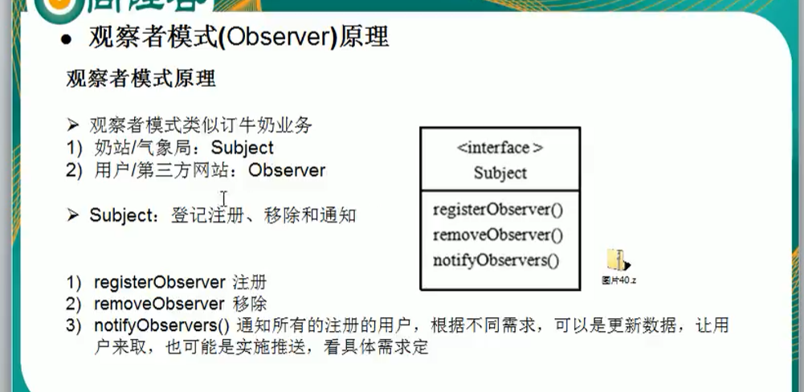

subject类似于WeatherData。

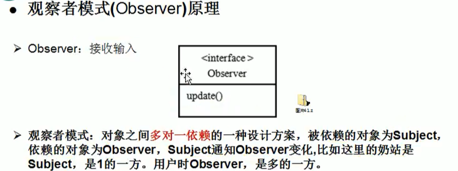

观察者模式基本原理：

- 对象之间多对一依赖的一种设计方案，被依赖的对象为Subject，依赖的对象为Observer，Subject通知Observer变化，这里的奶站是Subject，是一的一方，用户是Observer，是多的一方。

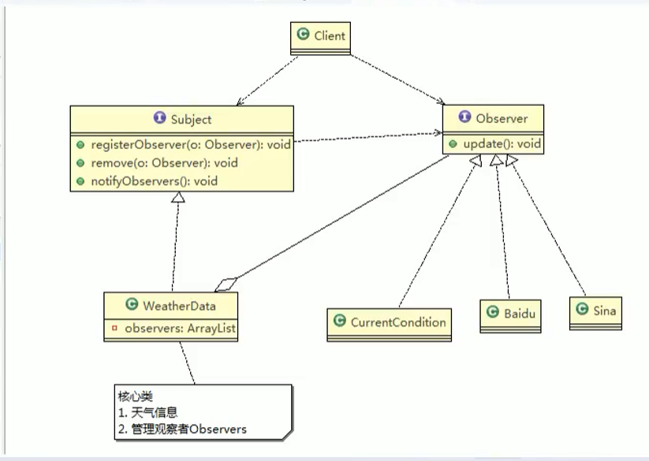

Subject:

```java
package observer.improve;

public interface Subject {
    void registerObserver(Observer o);

    void removeObserver(Observer o);

    void notifyObservers();
}
```

WeatherData:

```java
package observer.improve;


import java.util.ArrayList;

/**
 * 核心类
 * 1.包含最新的天气情况信息
 * 2.包含所有观察者集合，使用ArrayList管理
 * 3.当数据有更新时，主动调用ArrayList,通知所有的接入方，看到最新的信息
 *
 * @author zhengchuxuan
 */
public class WeatherData implements Subject {
    private float temperature;
    private float pressure;
    private float humidity;
    private ArrayList<Observer> observers;

    public WeatherData() {
        observers = new ArrayList<Observer>();
    }

    public float getTemperature() {
        return temperature;
    }

    public float getPressure() {
        return pressure;
    }

    public float getHumidity() {
        return humidity;
    }

    // 当数据有更新时，就调用setData
    public void setData(float temperature, float pressure, float humidity) {
        this.temperature = temperature;
        this.pressure = pressure;
        this.humidity = humidity;
        // 调用dataChange，将最新的信息推送给接入方
        dataChange();
    }

    public void dataChange(){
        notifyObservers();
    }
    // 注册观察者
    @Override
    public void registerObserver(Observer o) {
        observers.add(o);
    }

    // 移除观察者
    @Override
    public void removeObserver(Observer o) {
        observers.remove(o);
    }

    // 遍历所有的观察者，并通知
    @Override
    public void notifyObservers() {
        for (int i = 0; i < observers.size(); i++) {
            observers.get(i).update(this.temperature, this.pressure,this.humidity);
        }
    }
}
```

observer:

```java
package observer.improve;

public interface Observer {
    void update(float temperature, float pressure, float humidity);
}
```

CurrentConditions:

```java
package observer.improve;

public class CurrentConditions implements Observer{
    // 温度，气压，湿度
    private float temperature;
    private float pressure;
    private float humidity;

    // 更新天气情况，由WeatherDate调用，使用推送模式
    public void update(float temperature, float pressure, float humidity) {
        this.temperature = temperature;
        this.pressure = pressure;
        this.humidity = humidity;
        display();
    }

    // 显示
    public void display() {
        System.out.println("TODYA mTemperature:" + temperature);
        System.out.println("TODYA mPressure:" + pressure);
        System.out.println("TODYA mHumidity:" + humidity);
    }
}
```

Client:

```java
package observer.improve;

public class Client {
    public static void main(String[] args) {
        // 创建一个weatherdata
        WeatherData weatherData = new WeatherData();
        // 创建观察者
        CurrentConditions currentConditions = new CurrentConditions();
        // 注册到weatherData
        weatherData.registerObserver(currentConditions);
        // 测试
        weatherData.setData(10f, 100f, 30.3f);
    }
}
```

观察者模式的优点：

- 观察者模式设计后，会以集合的方式管理用户（Observer），包括注册，移除和通知
- 增加观察者，不需要修改核心类WeatherData的代码，遵守了ocp原则